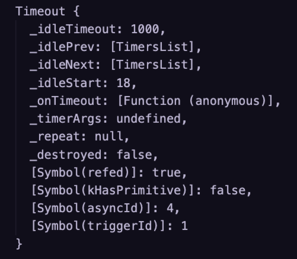

# 2.全局对象

global 常用的属性：

和 window 对象不同，setTimeout 返回的是一个对象：

__dirname：

    - 返回该模块所在的目录。

    - __dirname 并非 global 的属性。

__filename：

    - 获取当前模块所在的文件路径。

Buffer:

    - 类型化数组

    - 继承自 UInt8Array

    - 计算机中存储的基本单位：字节

    - 使用时，输出时可能会用到十六进制

process:

    - 进程对象

    - cwd() 获取当前命令行所在的路径，返回绝对路径。

    - exit() 强制退出 Node 的进程。

argv:

    - 获取命令中的参数

platform：

    - 返回当前设备的操作系统

kill(pid):

    - 杀死进程

env:

    - 获取电脑的环境变量