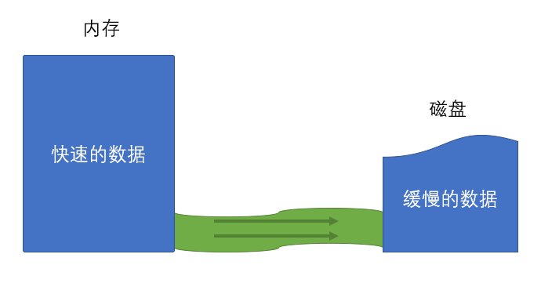

# 文件流

文件流是流的一种。

一个文件，图片，几百兆

一个文件，小说文本，几个G

使用 fs.readFile 读取文件没有问题，但是内存空间是非常有限的，我们希望读取文件是一点点的读取。

## 什么是流？

流是指数据的流动，数据从一个地方缓缓的流动到另外一个地方。

流是有方向的：

- 可读流 Readable：数据从源头流向内存；

- 可写流 Writable：数据从内存流向源头

- 双工流 Duplex：数据既可以从源头流向内存，又可以从内存流向源头

## 为什么需要流？

1、其他的介质和内存的数据规模不一样

2、其他的介质和数据处理能力不一致

## 文件流

什么是文件流？

内存数据和磁盘数据之间的流动。数据（一张图片、一篇小说）从磁盘文件读取到内存就是可读流，如果说内存中的一些数据要往文件里面写，就是可写流。

文件流的创建：

文件可读流 fs.createReadStream(path[, options])

> 详见导图！！！

- 返回 Readable 流对象的子类 ReadStream

    - rs.on('事件', handler)

    - rs.pause() 读取暂停，会触发 paush 事件

    - rs.resume()，读取恢复，会触发 resume 事件

通常使用流是为了使用一部分数据后就扔掉了，在读取下一部分的流数据。