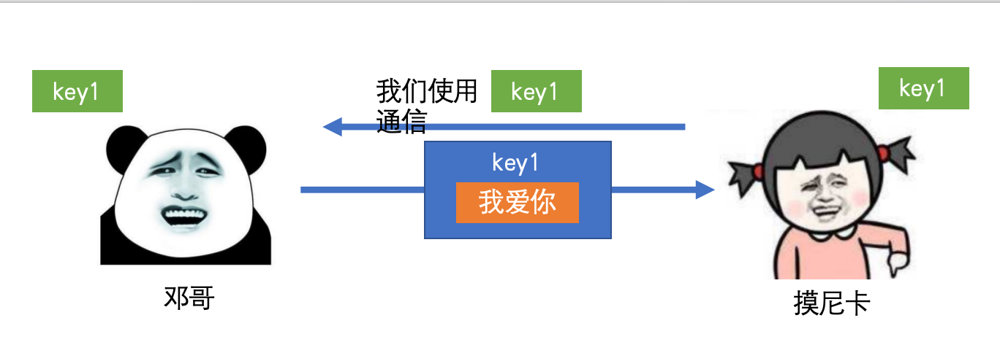
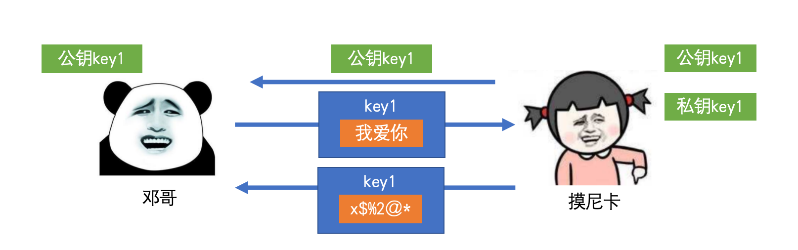
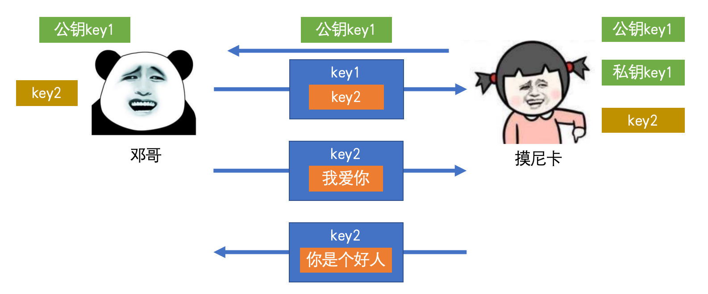
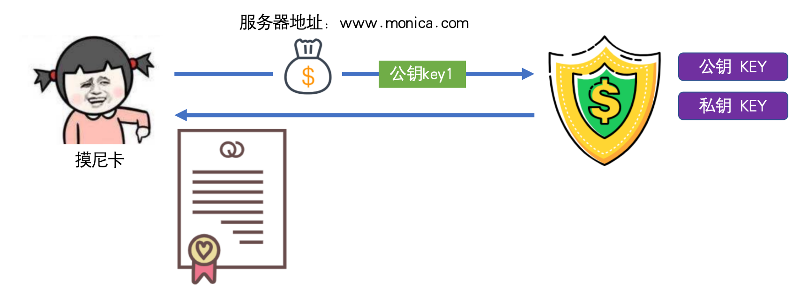

# https 模块

https 协议可以保证数据在传输的过程中不被窃取和篡改，从而保证传输安全。

http 协议传输的数据是明文传输的，及其的不安全。

为了防止第三方截取到数据，可以使用加密来保证数据的安全。

## 加密：

- 对称加密：产生一个密钥，该密钥既可以加密也可以解密。例如：DES、3DES、AE6、Blowfish 等等。

    - 

    - 问题：s端如何把key传送给c端？第一次传输密钥被x截取那么加密就无意义。以后c端和s端通信的时候就可以被x解密。

- 非对称加密：产生一对密钥，一个用于加密一个用于解密（一个公钥，一个私钥）。例如：RSA、Elgamal、Rabin、D-H、ECC等。

    - 公钥通常是公开的，可以被随便获取

    - 私钥是极其保密的，绝对不能外泄

    - 使用一个加密，另外一个进行解密。例如使用公钥进行加密，使用私钥进行解密

    - 

        - c端获取公钥

        - c端加密发送数据给s端

        - s端使用私钥解密，得到真实数据

        - s端使用公钥加密数据，返回到c端

        - c端无法使用公钥解密公钥加密的数据！！因为c端没有私钥！

- 对称加密 + 非对称加密组合使用

    - 

    - c端获取到非对称加密公钥 key1，c端在本地产生一个对称加密的密钥 key2

    - c端使用非堆成公钥 key1 加密对称密钥 key2 到s端

    - s端使用非对称私钥 key1 解密得到对称密钥 key2

    - 后续，c端使用密钥 key2 加密数据，s端使用密钥 key2 解密

    - 还说存在问题，x端虽然无法读取到加密的内容，但是x端可以在c端第一次获取公钥 key1 的时候进行篡改，然后把假的公钥发送给c端

    - 

    - 

    - c端使用假的非对称公钥加密本地产生的私钥，然后发送给s端，这个时候会被x端截取，x端使用当时篡改的非对称私钥进行解密，得到c端产生的密钥，然后在使用s端真正的公钥加密发送给s端

    - 后续请求都会被x端拦截解密

## 证书颁发机构 CA（Certificate Authority）：

权威机构，安装浏览器或者操作系统的时候会对世界上已知的权威机构全部记录下来。

证书是一个电子证书，包含服务器的地址、颁发机构、公钥、证书签名.

证书的颁发流程：

- 

- s端把服务器域名，s端的非对称公钥（s端会生成非对称的公钥和私钥），费用

- 权威机构也有自己的非对称公钥和私钥，私钥绝对不会外泄，公钥是可以随便获取到的

- 权威机构会给s端一个证书（证书包括：s端的域名、证书颁发机构、使用机构私钥加密后的s端的公钥、使用机构私钥加密后证书签名）。因为这些信息都使用使用证书机构的私钥进行加密的，所以其他终端只能使用证书机构的公钥进行解密，无法重新加密伪造！例如x端使用证书的公钥解密篡改了证书中的s端公钥，然后再进行加密，但是x端是无法加密的，因为x端拿不到证书的私钥，加密后的数据，其他终端无法使用证书的公钥加密，也就无法验证安全性

    - 证书签名，机构之间存在差异，但是基本上都是按照：s端域名、s端的公钥、证书的公钥通过一种算法（算法是公开的）一起来生成一种签名

    - 终端是可以根据这三个东西来验证签名是否被篡改的！

后续的流程：

- 

- c端发起请求，s端返回证书给c端

- c端拿到证书后，自动进行处理

    - c端使用机构的公钥进行解密得到：s端的公钥、证书签名

    - 验证签名，使用和证书同样的逻辑（s端域名、s端的公钥、证书的公钥）进行加密，对比计算出的结果是否和证书中的签名一致！x端虽然可以读取到证书的内容，但是篡改后会被对比错误！

    - c端产生对称密钥，使用s端的公钥进行加密，传输给s端

    - s端通过私钥进行解密，得到c端的密钥

    - 然后双方可以根据c端的密钥进行数据的加密 
    