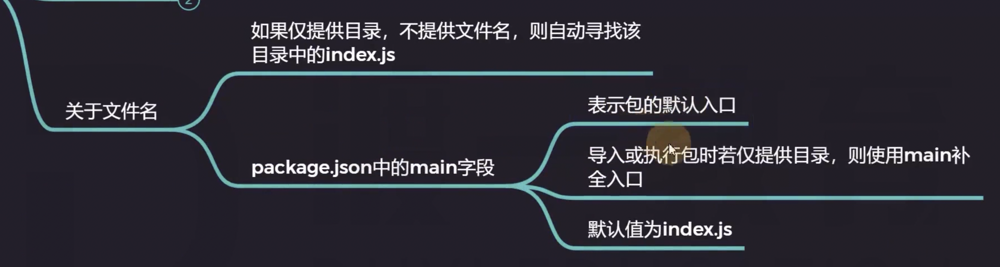

# 03.模块化的细节

## 模块的导入

require() 导入模块：

- 绝对路径，`require("/Users/xiechen/Documents/code-personal/duyi/NodeJS/src/02/index.js");`

- 相对路径，`require("../02/index.js");`

- 相对路径2


- 后缀名


- 文件名



## module 对象

## require() 函数

- require.resolve(path) 解析路径，返回一个绝对路径

## 模块化的原理

```js
console.log('当前模块的路径：', __dirname);
console.log('当前模块的文件：', __filename);

/* exports.c = 3;
module.exports = {
  a: 1,
  b: 2
};
this.m = 5;
// 返回 { a: 1, b: 2 } */

exports.c = 3;
exports.a = 1;
exports.b = 2;
this.m = 5;
// 返回 { c: 3, a: 1, b: 2, m: 5 } 
```

```js
console.log(require("./myModule"));
```

