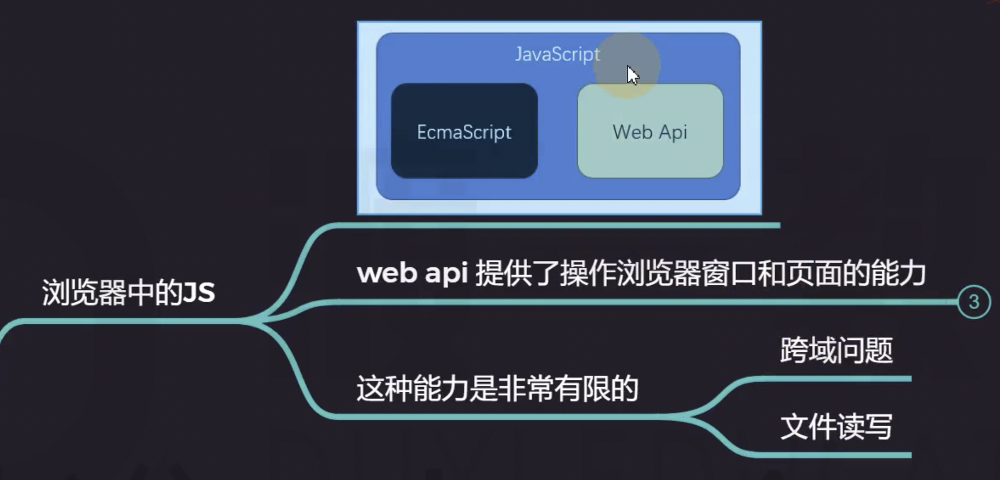
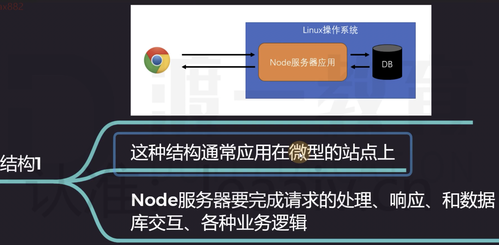
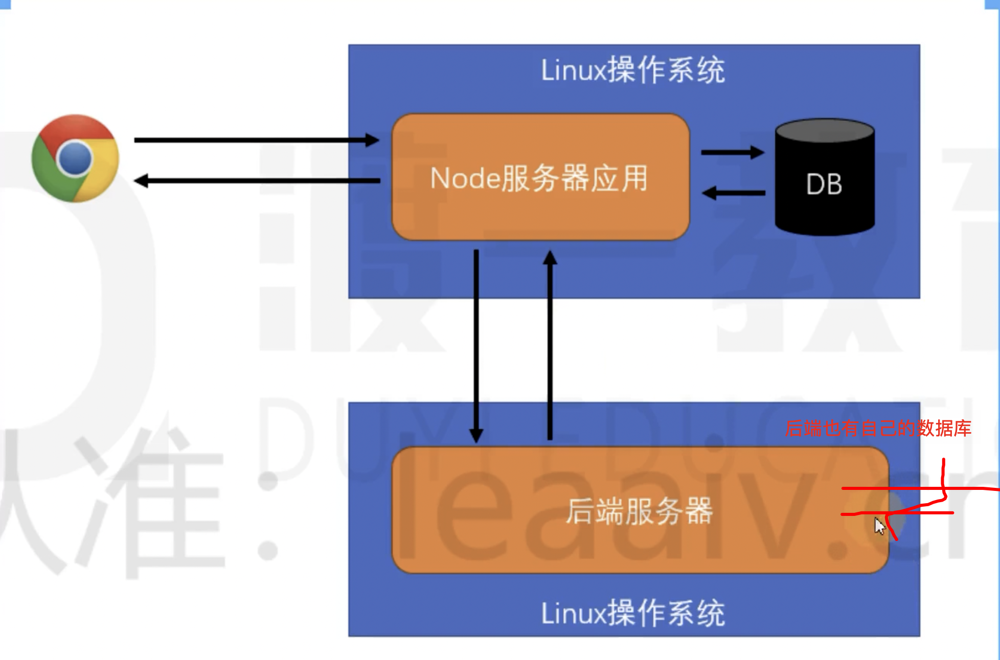

什么是 Node？

Node 是一个 JS 的允许环境。

拥有比浏览器更多的能力。

> JavaScript 一般指在浏览器运行的 JS，NodeJS 指在 Node 环境运行的 JS!

## 浏览器中的 JS

有限制的：例如上传文件。

## NodeJS 中的 JS

## 对比

浏览器作为一个操作系统的软件功能是非常强大的，只是不会开发者进行开放。

## NodeJS 可以干什么

NodeJS 是单线程异步的程序，IO 处理速度是非常快的。

IO：input/output 输入输出。

Node 是适合做一些简单的 API 请求，不适合做一些复杂的请求。

## 用 NodeJS 干什么

- 开发桌面应用程序

- 开发服务器应用程序

客户端发起请求，NodeJS 处理请求，返回响应。

作为一个中间层，也可以记录一些数据到数据库。

## 安装 NodeJS

https://nodejs.org/en/
