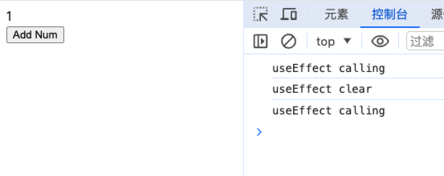

# Hooks

## 基本介绍

Hoos 是 React16.8 新增的特性，在不编写 class 的情况下，使用 state 和其他的特性。

解决的问题：

- 告别令人疑惑的生命周期

- 告别类组件中烦人的 this 指向

  - 在类组件中存在 this 的指向问题，例如在事件处理函数中不能直接通过 this 获取组件实利，需要修正 this 的指向。

- 告别繁重的类组件，让开发者回归熟悉的函数编程

- 一些不相关的代码全部放在一起容易产生 bug

Hook 的出现也表示 React 思想的转变，从面向对象的思想转化为函数式编程的思想。这是编程范式上面的转变。

所以会发现多了一些不熟悉的概念：纯函数、副作用、柯里化、高阶函数...

> 编程范式：简单理解为编程的思想。
> 命令式编程：告诉计算机如何做，强调的是 how，我们需要给计算机指明每一个步骤。

- 面向过程
- 面向对象
  > 声明式编程：告诉计算机我要什么，强调的是 what
- 函数式编程
- DSL（领域专用语言，HTML、CSS、SQL）
  > 声明式编程并不是新的产物，是和命令式编程同时期出现的，但是早期更加流行命令式编程。不过随着近几年整个项目工程越来越复杂，以前的命令式编程就有点力不从心了，所以现在慢慢流程声明式编程。

Hook 本质上就是 JS 的函数，但是用的时候有两个额外的规则：

- 只能在函数最外层调用 hook

- 只能在 React 函数组件中调用 hook

## useState 和 useEffect

随着 React 的更新，Hooks 还在增加。

### useState

```jsx
import { useState } from 'react';

function App() {
  // num 表示数据
  // setNum 表示更改数据的方法，接受一个参数为新数据
  let [num, setNum] = useState(0);

  function onClickBtn() {
    setNum(++num);
  }

  return (
    <>
      <p>{num}</p>
      <button onClick={onClickBtn}>Add Num</button>
    </>
  );
}
export default App;
```

Hook 在 Class 组件内部是不起作用的！

### useEffect

useEffect 主要是解决副作用的，什么是副作用？首先要介绍纯函数。

纯函数：一个确切的参数在你的函数中运行之后，一定能得到一个确切的值。

```js
// 放在函数式编程中，这就一个纯函数。
function test(x) {
  return x * 2;
}
```

如果函数内存在副作用，那么这个函数就不是纯函数，所谓副作用就是指函数的结果是不可预期的！

常见的副作用：发送网络请求、添加监听事件或者取消监听、修改 DOM、读取文件。

之前我们将这些副作用都是放在生命周期函数中的，但是现在放在了 useEffect 这个 Hook 中。

基本使用：

```jsx
export default function App() {
  let [count, setCount] = useState(0);

  useEffect(() => {
    // 书写你要执行的副作用，会在 render 完成后执行，类似于 didMount 和 update 的结合
    // useEffect 会在每次状态更改后都执行
    console.log('useEffect');

    document.title = '你点击了' + count + '次';
  });

  function onClickBtn() {
    setCount(count + 1);
  }

  return (
    <>
      <div>{count}</div>
      <button onClick={onClickBtn}>Add Num</button>
    </>
  );
}
```

执行清理工作：

前提代码，疯狂的点击按钮，数字飞速的增加。因为每次点击都产生一个新的计时器。

```jsx
useEffect(() => {
  setInterval(() => {
    console.log('useEffect');
  }, 1000);
});

function onClickBtn() {
  setCount(count + 1);
}
```

在 useEffct 可以返回一个函数，该函数被称为清理函数（因为主要用来做一些清理操作），该函数会在 render 执行之后，下一次执行副作用函数之前执行，可以用来清除上一次的副作用。

```jsx
useEffect(() => {
  console.log('useEffect calling');

  return () => {
    console.log('useEffect clear');
  };
});
```



```jsx
useEffect(() => {
  const stopTimer = setInterval(() => {
    console.log('useEffect');
  }, 1000);

  return ()=>{
    clearInterval(stopTimer)
  }
});
```

副作用的依赖：目前我们的副作用函数，每次重新渲染后，都会重新渲染，有些时候我们是需要设置依赖项的，如果想要副作用只执行一次需要传递第二个参数，第二个参数为一个依赖数组。

表示只有 count1 变化的时候才会执行副作用函数：


如果只想要副作用函数执行一次，那么传递一个空数组即可！

```jsx
useEffect(() => {
  fetchData().then((res) => {
    console.log(res)
    setCount(res)
  });
},[]);
```

## 自定义 Hook

自定义的 hook 就是函数，和普通函数具有以下的区别：

- 函数内部需要调用官方的 hook

- 函数的命名以 use 开头，并不是强制的规则，而是一种约定

```jsx
// useMyBook.jsx
import { useState } from 'react';

export default function useMyBook() {
  const [bookName, setBookName] = useState('学习 ReactJS');
  return { bookName, setBookName };
}
```