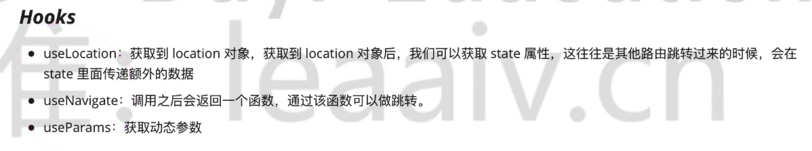

## React Router 总结




## 补充

### useRoutes

```jsx
import React from 'react';
import { useRoutes, Navigate } from 'react-router-dom';

import Home from './components/Home';
import About from './components/About';
import AddOrEdit from './components/AddOrEdit';
import Detail from './components/Detail';

function Router() {
    return useRoutes([
        {
            path: '/',
            element: <Navigate replace to='/home' />
        },
        {
            path: '/home',
            element: <Home />
        },
        {
            path: '/about',
            element: <About />
        },
        {
            path: '/AddOrEdit',
            element: <AddOrEdit />
        },
        {
            path: '/Detail',
            element: <Detail />
        }
    ]);
}

export default Router;
```

### 嵌套路由

```jsx
{
    path: '/about',
    element: <About />,
    children: [
        {
            path: 'email',
            element: <Email />
        },
        {
            path: 'Tel',
            element: <Tel />
        },
        {
            path: '',
            element: <Navigate replace to='/about/email' />
        }
    ]
}
```

```jsx
import React from 'react';
import { NavLink,Outlet } from 'react-router-dom';

function About(props) {
    return (
        <div className='about container'>
            <h1 className='page-header'>使用说明</h1>
            <p>通过此系统来熟悉 React 和 react-router-dom 的使用</p>
            <p>联系方式</p>
            <NavLink to='/about/email'>邮箱</NavLink>
            <NavLink to='/about/tel'>电话</NavLink>
            <Outlet />
        </div>
    );
}

export default About;
```

`<Outlet />` 组件用于显示嵌套的子路由！