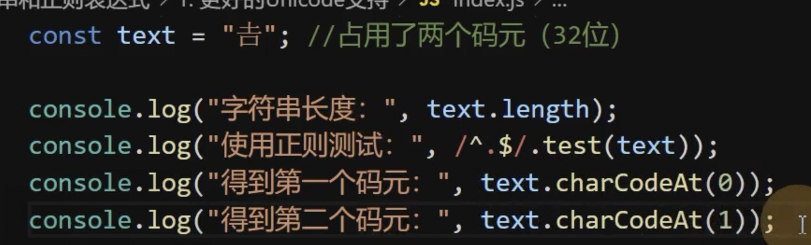
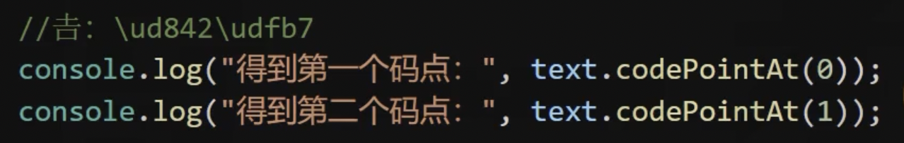
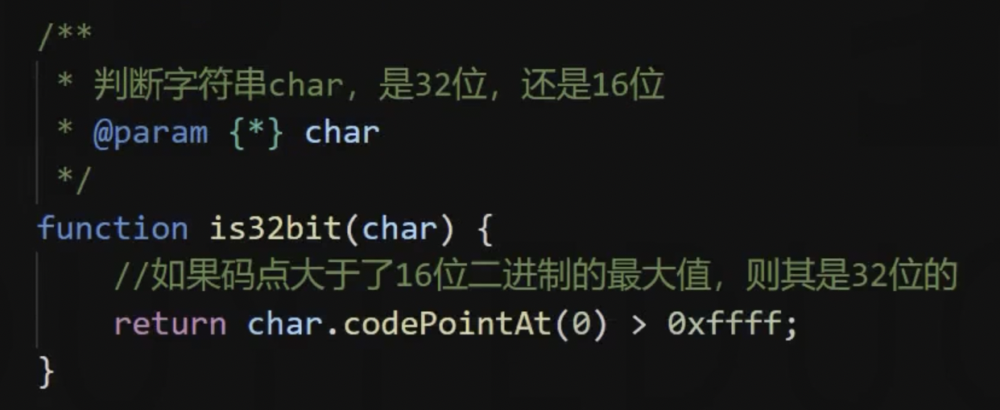

# 字符串和正则表达式

## 更好的 Unicode 支持

早期由于存储空间宝贵 Unicode 使用的是 16 位二进制来存储文字。我们将一个 16 位的二进制编码称为码元（Code Unit）。

后来由于技术的发展，Unicode 对文字编码进行了拓展，将某一些文字扩展了到了 32 位，也就是占用两个码元，并且将某个文字对应的二进制数字称为码点（Code Point）。



使用的是码元进行匹配的，而不是码点，所以 length 长度为 2，正则也是使用码元进行匹配的。

ES6 为了解决这个问题，提供了方法：codePointAt()，根据字符串码元的位置得到其码点:



判断一个字符是否是 32 位：



同时 ES6 为正则添加了一个 flag：u，表示使用码点进行匹配。

## 更多的字符串 API

详见 ../code/index1.js

## 正则的粘连标记

标记名：y，例如之前的 g 全局匹配。

表示匹配的时候，完全按照正则对象中的 lastIndex 位置开始匹配，并且匹配的位置必须在 lastIndex 位置。

```js
const text = 'Hello, World!!!';
const reg = /W\w+/;
const reg1 = /W\w+/y;

console.log(reg.test(text)); // true

console.log(reg1.lastIndex);
// 加上 y 标记后，就类似于要求在 lastIndex 就必须要满足正则，类似于 ^W\w+
console.log(reg1.test(text)); // false

reg1.lastIndex = 7;
console.log(reg1.test(text)); // true
```

## 模版字符串

详见 ../code/index3.js

## 模版字符串标记

详见 ../code/index4.js
