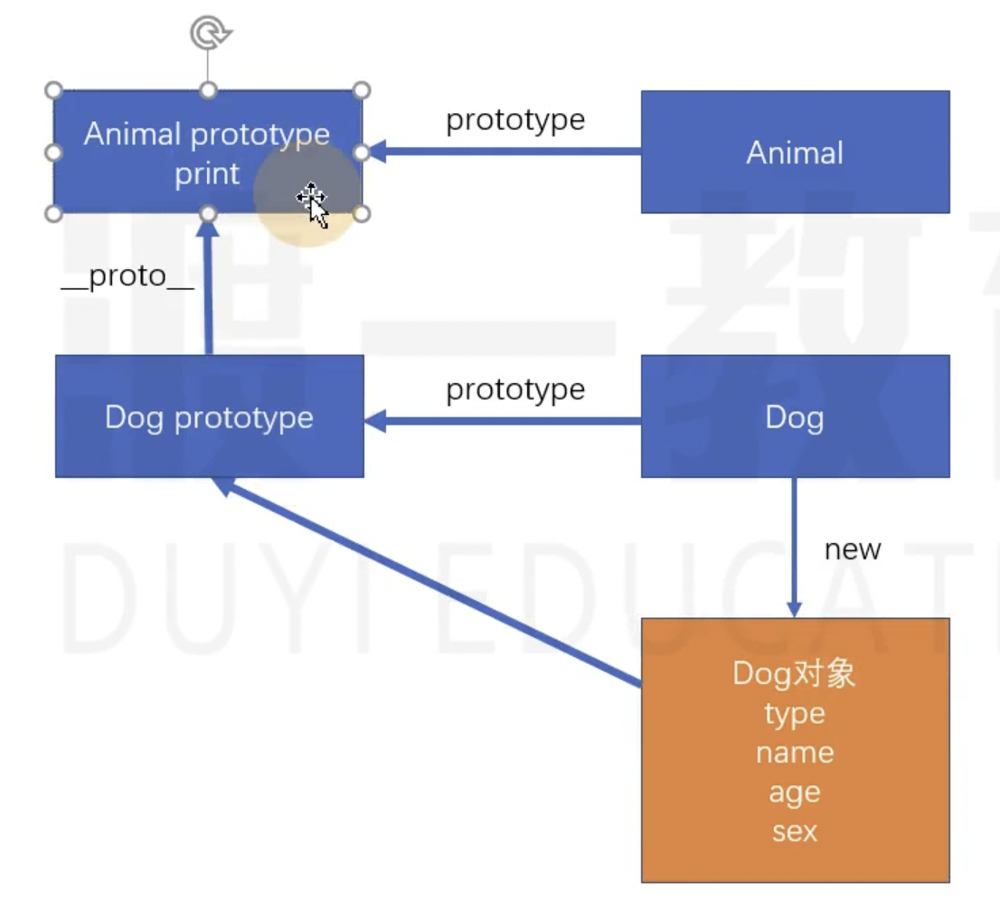

# 对象

## 新增对象字面量

详见 ../code/index.js

## Object 的新增 API

详见 ../code/index1.js

## 面向对象简介

面向对象是一种编程思想，和具体的语言没有任何的关系。

只是用面向对象的思维进行编程。

JS 也是面向对象语言，只是 ES5 之前并不方便。

对比面向过程：

-   面向过程的思考的切入点是功能步骤，也就是要考虑功能的第一步要做什么，第二步要做什么

-   面向对象的思考切入点是对象的划分

【大箱装冰箱的案例】

面向过程的步骤：

```js
// 1、打开冰箱门
function openFrige() {}

// 2、大箱装进去
function elephantIn() {}

// 3、冰箱门关上
function closeFrige() {}
```

没有绝对的好坏，面对不同的场景和复杂度各有各的优势。面向过程适合精小的功能，面向对象适合复杂的系统。

面向对象的步骤：

思考程序中有哪些对象？根本不考虑第一步、第二部的步骤

```js
// 大象对象
function Elphant() {}

// 冰箱对象
function Frige() {}
Frige.prototype.open = function () {};
Frige.prototype.close = function () {};
Frige.prototype.join = function (something) {};

// 通过对象的方式把功能描述完成了
// 接下来开始调用对象
var firge = new Frige();
var elphant = new Elphant();
firge.open();
firge.join(elphant);
firge.close();
// 仍然有步骤，只是思考的切入点不一样
```

在大箱项目中，要考虑项目的可维护性、可拓展性，那么面向对象是药强于面向过程的！

例如冰箱要装的不是大象了，而是别的东西，这个时候就可以进行随意的组合了。

## 类：构造函数的语法糖

详见 ../code/index2.js

## 类的其他书写方式

详见 ../code/index3.js

## 类的继承

