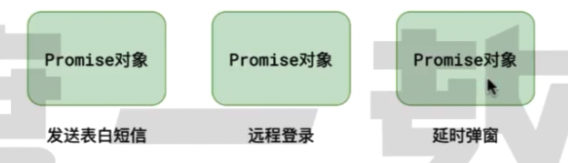

# Promise

## Promise 基础

详见 ../code/index.js

### Promise 规范

Promise 规范：制定了如何实现。
Promise API：根据规范实现具体的代码。

Promise 是一套专门处理异步的规范，能够有效地避免回调地狱的产生，使异步代码更加的清晰、简洁、统一。
这个规范最早诞生于前端社区中，命名为 Promise A+（因为最开始是 A 规范，但是很快就被淘汰了）
https://promisesaplus.com/
该规范出现后，立即得到很多开发中的响应。

Primise A+ 的规定：

1、所有的异步场景，都可以看作是一个异步任务，每个异步任务在 JS 表现为一个对象，该对象称为 Promise 对象。



2、每个异步任务都应该有两个阶段、三个状态。


逻辑如下:

- 任务总是从未决变成已决，无法逆行！

- 任务总是从挂起状态变成完成或者失败状态，无法逆行！

- 任务一旦变成完成或者失败状态，无法再改变！

3、挂起=》完成称为 resolve，挂起=》失败称为 reject。任务完成时，可能有一个相关数据；任务失败时，可能有一个失败的原因。


4、可以针对任务进行后续的处理，针对完成状态的后续处理称为 onFulfilled, 针对失败的后续处理称为 onRejected。


### Promise API


## catch 方法

只想处理失败，不想处理成功！

`.catch(onRejected)` = `.then(null, onRejected)`

## Primise 的链式调用

案例：学习 考试 出成绩 读大学


后续处理也是一个新任务，链式处理。

```js
const pro1 = new Promise((resolve, reject) => {
  console.log('学习');
  resolve();
});

const pro2 = pro1.then((data) => {
  console.log('考试');
});

// console.log(pro2);

const pro3 = pro2.then((data) => {
  console.log('出成绩');
});

console.log(pro3);
```

1、then 方法必定返回一个新的 Promise（可以理解为后续处理也是一个任务）

2、新的任务的状态取决于后续处理：

- 若没有相关的后续处理，新任务的状态和前任务状态一致，数据为前任务的数据。

```js
// 只处理了成功的情况，没有处理失败的情况

const pro1 = new Promise((resolve, reject) => {
  console.log('学习');
  console.log('中奖了，不用学习了');
  reject();
});
// 没有处理失败的情况
const pro2 = pro1.then((data) => {
  console.log('考试');
});
// 导致 pro2 的状态也跟着失败，因为后续无法进行了
console.log(pro2);
```

```js
// 只处理了失败的情况，没有处理成功的情况

const pro1 = new Promise((resolve, reject) => {
  console.log('学习');
  resolve();
});
// pro1 的状态为成功，pro2 的状态也为成功！
const pro2 = pro1.catch((data) => {
  console.log('学习失败了');
});
console.log(pro2); // fulfilled
```

- 若有后续处理但还未执行，新任务挂起。

```js
const pro1 = new Promise((resolve, reject) => {
  console.log('学习');
  setTimeout(() => {
    resolve();
  }, 2000);
});
// pro1 状态没有落定，pro2 的状态也不会落定
const pro2 = pro1.catch((data) => {
  console.log('学习失败了');
});
console.log(pro2); // pending
```

- 若后续处理执行了，则根据后续处理的情况确定新任务的状态。

  - 后续执行处理无错，新任务的状态即为完成，数据为后续处理的返回值。

  ```js
  const pro1 = new Promise((resolve, reject) => {
    console.log('学习');
    resolve();
  });
  const pro2 = pro1.then((data) => {
    // 不产生错误，则 pro2 的状态即为成功！
    console.log('考试');
    return '100分';
  });
  console.log(pro2); // fulfilled 值为 100分
  ```

  ```js
  const pro1 = new Promise((resolve, reject) => {
    console.log('学习');
    reject('中奖了，不用学习了');
  });
  const pro2 = pro1.catch((error) => {
    // 处理的过程中不报错，pro2 的状态即为成功
    console.log('在家养老吧');
  });
  ```

  - 后续执行处理有错，新任务的状态即为失败，数据为后续处理抛出的错误。

```js
const pro1 = new Promise((resolve, reject) => {
  console.log('学习');
  resolve();
});
const pro2 = pro1.then((data) => {
  console.log('考试');
  // 如果发送错误，则 pro2 的状态即为失败
  throw new Error('考试失败');
});
console.log(pro2); // rejected
```

```js
const pro1 = new Promise((resolve, reject) => {
  console.log('学习');
  reject('中奖了，不用学习了');
});
const pro2 = pro1.catch((error) => {
  // 处理的过程中报错，pro2 的状态即为失败
  throw new Error('颁奖的机构跑路了');
});
console.log(pro2); // rejected
```

- 记住：如果任务 1 的状态被任务 2 处理了，那么任务 2 的状态取决于后续处理过程情况（不管处理的是成功函数还是失败函数）。

- 后续执行处理抛出的是 Promise，则新任务的状态和 Promise 一致，数据为 Promise 的数据。

```js
const pro1 = new Promise((resolve, reject) => {
  console.log('学习');
  resolve();
});
const pro2 = pro1.then((data) => {
  // pro2 的状态和 new Promise() 的状态一致！
  return new Promise((resolve, reject) => {
    reject();
  });
});

console.log(pro2); // rejected
```

链式调用任务的存在，异步代码具有更强的能力：


## 邓哥的解决方案


## Promise 的静态方法

详见 ../code/index2.js