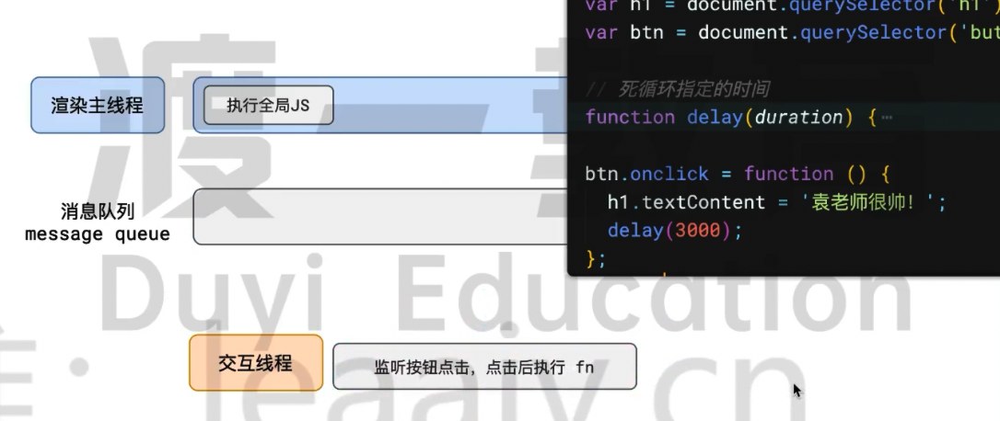
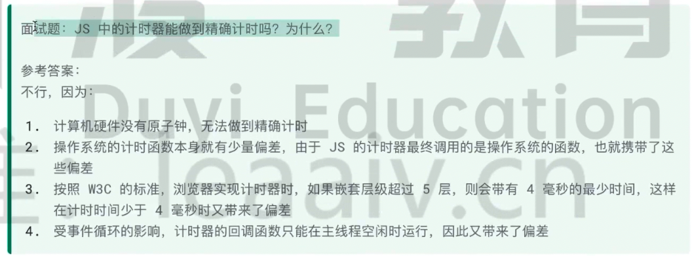

# 事件循环

https://gitee.com/dev-edu/frontend-training/blob/master/02.%20JavaScript%E8%AF%AD%E8%A8%80%E6%8F%90%E5%8D%87/05.%20%E4%BA%8B%E4%BB%B6%E5%BE%AA%E7%8E%AF/%E8%AF%BE%E4%BB%B6.md

和浏览器密切相关！得先了解浏览器。

## 浏览器的进程模型

### 何为进程？

程序运行的时候需要有她自己的专属内存空间，可以把这段内存空间理解为进程。


每个程序至少有一个进程，进程之间相互独立，即使要进行通信，也需要双方同意！

因为进程设计的目的就是为了隔离，每个程序自己出现问题不会影响到其他程序。

### 何为线程？

有了进程后，才可以运行代码。

运行代码的「人」称为「线程」。

一个进程至少有一个线程，所以进程开启后会自动创建一个线程来运行代码，该线程被称为主线程。

很多时候程序比较复杂，一个程序要同时运行多块代码，很多任务同时进行一个线程忙不过来，主线程就会启动更多的线程来执行代码，所以一个进程中可以包含多个线程，多个线程共享一块进程。


### 浏览器有哪些进程和线程？

浏览器是一个多进程多线程的应用程序！

多进程：浏览器内部及其复杂，为了避免相互影响，为了减少连环奔溃的几率（如果只有一个进程，所有的事情全部在一块完成，很容易导致一个功能出问题，整个浏览器奔溃），当浏览器启动后，他会自动启动多个进程。


主要的进程：

- 浏览器器进程

  - 负责界面的展示（标签页的展示、前进后退按钮）、用户交互、子进程管理（程序启动的时候只有一个进程，然后里面启动了网络、渲染等子进程）等。浏览器进程内部会启动多个线程处理不同的任务。

- 网络进程

  - 负责加载网络资源。网络进程内部会启动多个线程来处理不同的网络任务。

- 渲染进程

  - 渲染进程启动后，会开启一个「渲染主线程」，主线程负责执行 HTML CSS JS 代码。

  - 默认情况下，浏览器会给每个标签页开启一个新的渲染进程，以保证不同的标签之间不相互影响。

## 浏览器渲染主线程是如何工作的？

渲染主线程是最繁忙的线程，需要他处理的任务包括但不限于：

- 解析 HTML

- 解析 CSS

- 计算样式

- 布局

- 处理图层

- 每秒把页面画 60 次（60FPS）

- 执行全局的 JS 代码

- 执行事件处理函数

- 执行计时器的回调函数

- ...

为什么渲染进程不能使用多个线程来处理这些任务？因为没有办法。

要处理这么多的任务，主线程遇到了一个前所未为的难题：如何调度任务？

比如：

- 我正在执行 JS 函数，执行到一半的时候用户点击了按钮，我该立即去执行点击事件的处理函数吗？

- 我正在执行 JS 函数，执行到一半的时候某个计时器到达了时间，我该立即去执行它的回调吗？

- 浏览器进程通知我“用户点击了按钮”，与此同时，某个时期也到达了时间，我应该处理哪一个呢？

- ...

渲染主线程提出了一个绝妙的主意来处理这个问题：排队！


> 根据这个图片可以回答上面的两个问题。

1、最开始的时候，渲染主线程会进入一个无限的循环

2、每一次循环都会检查信息队列中是否有任务存在。如果有，就取出第一个任务执行，执行完一个后进入下一次循环；如果没有，则进行休眠状态。

3、其他所有的线程（包括其他进程的线程）可以随时的向信息队列添加任务。新任务会添加到信息队列的末尾。再添加新任务的时候，如果主线程是休眠状态，则会将其唤醒以继续循环拿取任务。

这样一来，就可以让每个任务有条不絮的、持续的进行下去了。

整个过程就被称为事件循环（消息循环）。

## 若干解释

### 什么是异步？

代码执行的过程中会遇到一些无法立即处理的任务，例如：

- 计时器 setTimeout setInterval

- 网络请求 XHR Fetch

- 用户操作后需要执行的任务 addEventListener

如果让渲染进程等待这些任务的时机未到，就会导致主线程长期处于「阻塞」的状态，从而导致浏览器「卡死」。


> setTimeout 没有计时的功能，需要使用计时线程，实际上是一个通知的作用。

渲染主线程承担极其重要的工作， 无论如何都不能阻塞！

所以浏览器选择异步来解决这个问题。


提高了生产效率，一直在忙，但是不会阻塞主线程。


### JS 执行为何会阻碍渲染？

```html
<body>
  <h1>Mr. Yuan is awesome ！</h1>
  <button>change</button>
  <script>
    var h1 = document.querySelector('h1');
    var btn = document.querySelector('button');

    // 死循环指定的时间
    function delay(duration) {
      var start = Date.now();
      while (Date.now() - start < duration) {}
    }

    btn.onclick = function () {
      h1.textContent = '袁老师很帅！';
      delay(3000);
    };
  </script>
</body>
```

代码执行结果，页面卡死 3 秒页面内容变为 “袁老师很帅！”

使用事件循环来解释这个问题：

- `btn.onclick = function` 会告诉交互线程，监听按钮点击，点击后执行 fn



- 当用户点击了按钮后，交互线程把 fn 放在消息队列


- 主线程被唤醒，循环到消息队列，取出 fn 执行


- `hl.textContent = '袁老师很帅！';` 会设置 DOM 的文本，如果浏览器要看见更新后的内容，浏览器需要进行重新的渲染，会产生一个新的任务，需要在信息队列进行排队的。

- 然后函数继续运行，运行到循环 3 秒


- 循环结束后，fn 执行完成，然后从信息队列中读取任务，放在主线程中执行


因为 JS 和渲染都是在浏览器主线程上进行的，所以需要等着！

### 任务存在优先级吗？

任务没有优先级，在信息队列中先进先出

但是信息队列是有优先级的。

根据 W3C 的标准，消息队列分为两种：

旧的标准是分为宏任务队列、微任务队列。

最新的标准不再使用这种模式，因为两个队列搞不定这种负责的场景。

根据 W3C 最新的解释：

- https://juejin.cn/post/7246672925667082297

- https://html.spec.whatwg.org/multipage/webappapis.html#p%20erform-a-microtask-checkpoint

- 每个任务都有一个任务的类型，同一个类型的任务必须在一个队列，不同的任务类型可以分属于不同的队列。在一次事件循环中，浏览器可以根据实际的情况从不同的队列中取出任务执行。

- 浏览器必须准备好一个微队列，微队列中的任务优先所有其他任务执行。

在目前，谷歌的实现中，至少包含了下面的队列：

- 延时队列，用于存放计时器到达后的回调任务，优先级「中」

- 交互队列，用于存放用户操作后产生的事件（例如点击事件）处理任务，优先级「高」

- 微队列，用于存放需要最快执行的任务，优先级「最高」

添加任务到微队列的主要方式是使用 Promise、MutationObserver 等 API。

```js
Promise.resolve().then(函数)
```

练习题：

详见 ../code/index.js


面试题：




总结：

单线程是异步产生的原因，事件循环是异步的实现方式。