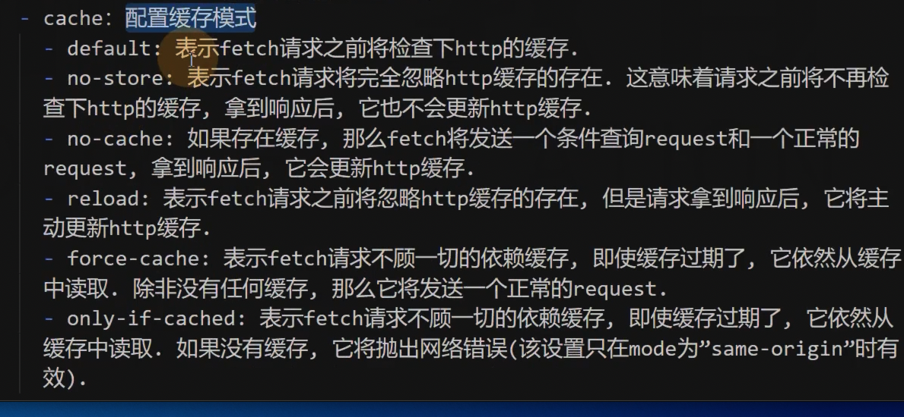

# 02 基本使用

使用 fetch 函数立即向服务器发送网络请求。

## 参数

函数的参数：

-请求地址，必填，字符串

- 对象，选填，请求配置，不传递则使用默认值

## 请求配置对象

- method：请求方法，默认是 GET

- headers：请求头，默认是空对象

- body：请求体，必须匹配 headers 中的 content-type

- mode：请求模式，默认是 cors，用来解决跨域问题

  - 默认是 cors，会在请求头内加入 origin 和 referer

  - no-cors：不会发送 origin 和 referer，跨域的时候可能出现问题

  - same-origin：指示只允许同源请求，如果请求其他域，则会报错（也就是只能发送给当前主机名，否则就会报错）

- credentials：请求凭证，默认是 same-origin

  - same-origin：请求同源地址携带 cookie 的凭证

  - include：请求任何地址携带 cookie

  - omit：不发送任何凭证

- cache：请求缓存，默认是 default



## 返回值

返回一个 Promise 对象。

- 当收到服务器的结果后，Promise 进入 fulfilled 状态，状态数据为 Response 对象。

- 当网络发送错误（或者其他导致无法完成交互的错误），Promise 进入 rejected 状态，状态数据为错误对象。

## Response 对象

- ok：布尔值，当状态码在 200-299 之间时为 true，否则为 false

- status：状态码

- statusText：状态文本

- headers：响应头

- url：响应地址

- redirected：布尔值，当响应地址和请求地址不同时为 true，否则为 false

- text()：用于处理文本格式的响应。它从响应中获取文本流，将其读完，然后返回一个被解决为 string 对象的 Promise。

- json()：返回一个 Promise 对象，解析响应体为 JSON 对象

- blob()：返回一个 Promise 对象，解析响应体为 Blob 对象

- arrayBuffer()：返回一个 Promise 对象，解析响应体为 ArrayBuffer 对象

- formData()：返回一个 Promise 对象，解析响应体为 FormData 对象

- redirect()：可以用于重定向到另外一个 URL 地址，他会创建一个新增的 Promise，以解决来自重定向 URL 的响应。

## Request 对象

fetch(url, options) 内部会将两个参数进行合并封装为一个 Request 对象，因此我们可以直接传递一个 Request 对象。

```js
new Request(url, options);
```

使用 request 对象的好处，某些时候要得到一个通用的请求方式，可以使用一个函数创建一个 request 对象。

```js
function getRequstInfo() {
  const url = 'https://v.api.aa1.cn/api/bilibili-rs/';
  const req = new Request(url, {});
  return req;
}
```

**注意：尽量保证每次请求都是一个新的 request 对象。**

```js
// bad

let request = null;

if (request) {
  // ...
} else {
  request = getRequstInfo();
}
```

请求的时候是要发送一个请求体的（POST），请求体内数据可能比较多，还可能是一个二进制文件，如果数据比较多的情况可能会形成一个流，如果服用 request 对象，那么就可能导致服用流的状态（例如上次文件流上传进度 100%）。

```js
let request = null;

if (request) {
  // 克隆一个全新的 request 对象，配置保持一致！
  request = request.clone();
} else {
  request = getRequstInfo();
}
```

## Response 对象

response 也可以进行手动的创建。绝大多数时候不需要自己手动创建，一般测试的时候可以自己手动创建。

```js
let resp = new Response('{"name":"张三"}', {
  // response 对象的一些配置
});

async function getJSON(resp) {
  return await resp.json();
}
```

## Headers 对象

在 request 和 response 对象中，headers 属性都是一个 Headers 对象。

同时，我们可以直接传递一个 Headers 对象。

好处在于可以实现复用。

在 Response 对象中说看不到 Headers 对象信息，需要使用相关的方法来进行获取。

- has(key) 检查头中是否存在指定的属性。

- get(key) 获取头中指定属性的值。

- set(key, value) 设置头中指定属性的值。

- append(key, value) 在头中追加指定属性的值。

- delete(key) 删除头中指定属性的值。

- forEach(callback) 遍历头中的所有属性。

- keys() 返回头中所有属性的 key 的迭代器。

- values() 返回头中所有属性的 value 的迭代器。

- entries() 返回头中所有属性的 key 和 value 的迭代器。