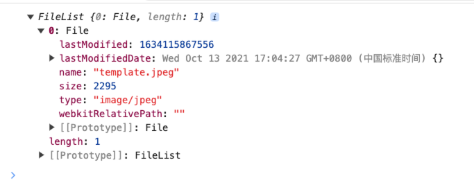
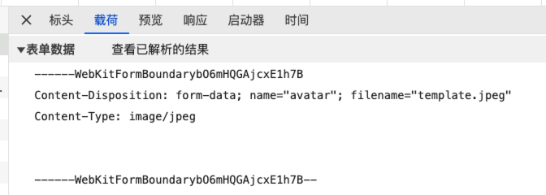

# 03 文件上传

流程：

1、客户端将文件数据发送给服务器

2、服务器保存上传的文件数据到服务端，并响应一个文件的访问地址

请求地址：http://101.132.72.36:5100/api/upload

请求方式：POST

请求的格式：multipart/form-data

```js
<form action='' enctype='multipart/form-data'></form>
```

请求体中必须包含一个键值对，键的名称必须是服务要求的名称，值是文件数据。

在 HTML5 中，JS 仍然无法随意的获取电脑的文件数据，但是可以获取 input 中被用户选中的文件数据。



```js
fileInput.addEventListener('change', function (e) {
  console.log(e.target.files);
});
```

里面包含了二进制数据，只是看不到。

拿到文件数据后，要构建请求体，得把 content-type 设置为 multipart/form-data

```http
POST /api/upload HTTP/1.1
Accept: text/html,application/xhtml+xml,application/xml;q=0.9,image/avif,image/webp,image/apng,*/*;q=0.8,application/signed-exchange;v=b3;q=0.7
Accept-Encoding: gzip, deflate
Accept-Language: zh-CN,zh;q=0.9
Cache-Control: max-age=0
Connection: keep-alive
Content-Length: 2484
Content-Type: multipart/form-data; boundary=----WebKitFormBoundarymtUAOVD8avVNBx43
Host: 101.132.72.36:5100
Origin: http://127.0.0.1:5500
Referer: http://127.0.0.1:5500/
Upgrade-Insecure-Requests: 1
User-Agent: Mozilla/5.0 (Macintosh; Intel Mac OS X 10_15_7) AppleWebKit/537.36 (KHTML, like Gecko) Chrome/126.0.0.0 Safari/537.36
```

`boundary=----WebKitFormBoundarymtUAOVD8avVNBx43`这是一个随机的分界线，每个分界符之间就是一个键值对数据

```http
------WebKitFormBoundarymtUAOVD8avVNBx43
Content-Disposition: form-data; name="dec"

这是一段文本内容
------WebKitFormBoundarymtUAOVD8avVNBx43
Content-Disposition: form-data; name="avatar"; filename="template.jpeg"
Content-Type: image/jpeg


------WebKitFormBoundarymtUAOVD8avVNBx43--
```



可以利用 HTML5 提供的 FormData 构造函数来创建请求体。

```js
const formData = new FormData();
formData.append('dec', '这是一段文本描述');
formData.append('filename', file);