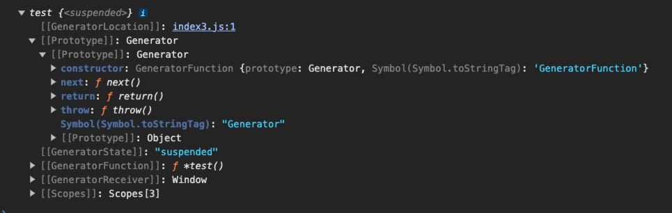

# 3 生成器

Generator

生成器最初的目的是为了更加方便的书写迭代器。

生成器后续增强了功能，所以生成器和迭代器存在一些联系，但是又具有一些独特的点。

1、什么是生成器？

生成器是一个通过构造函数 Generator 创建的对象。开发者无法创建这个对象，只能 JS 引擎内部使用。生成器既是一个迭代器，同时又是一个可迭代对象。

2、如何创建生成器？

生成器的创建必须使用生成器函数（Generator Function）。

3、如何书写一个生成器函数呢？

```js
// 这是一个生成器函数，该函数一定返回一个生成器
function *methodName(){}
function* methodName(){}
function*(){}

{
    *methodName(){}
}
```

案例，详见代码。

```js
function *test(){}
let t = test();
console.log(t);
```



4、生成器函数内部是如何执行的？

详见代码。

生成器函数内部是为了给生成器每次迭代提供数据的。

5、生成器有哪些需要注意的细节

详见代码。

6、生成器的其他 API

详见代码。
