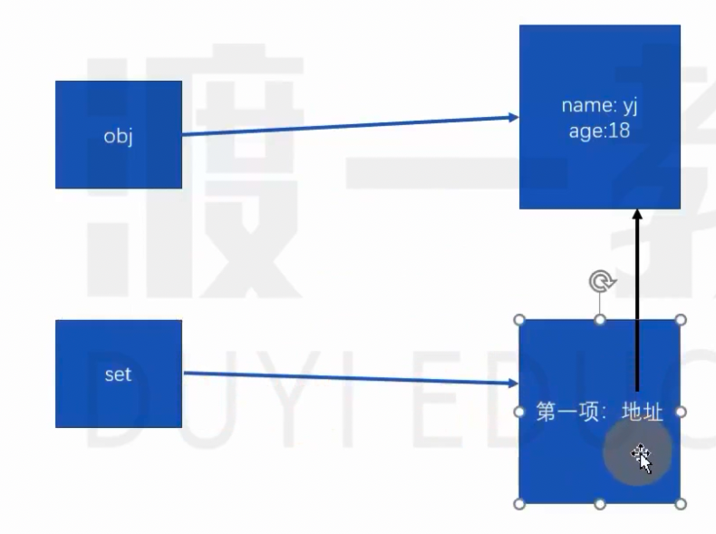
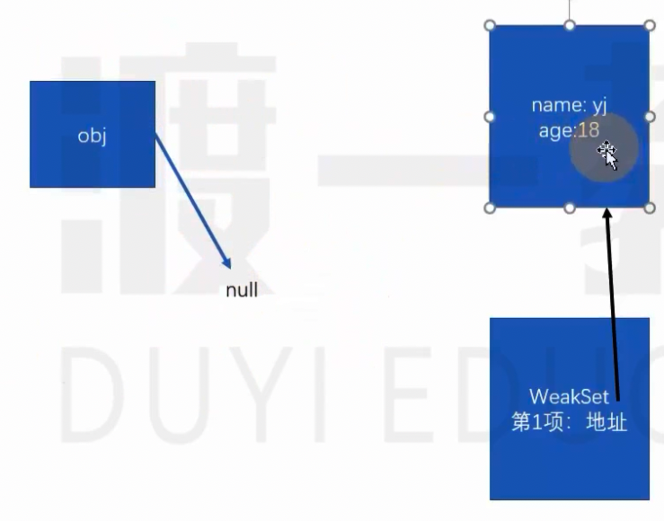

# Map 集合

## Map 集合

详见 ../code/index.js

## 手写 Map 集合

详见 ../code/index1.js

## WeakMap 和 WeakSet

详见 ../code/index2.js

## 观察者模式

有一个对象是观察者，它用于观察另外一个对象的属性值变化，当属性值变化后会收到一个通知，可能会做一些事。

详见 ../code/index3.js

## 偷懒的构造函数

详见 ../code/index4.js

## 可验证的函数参数

详见 ../code/index5.js