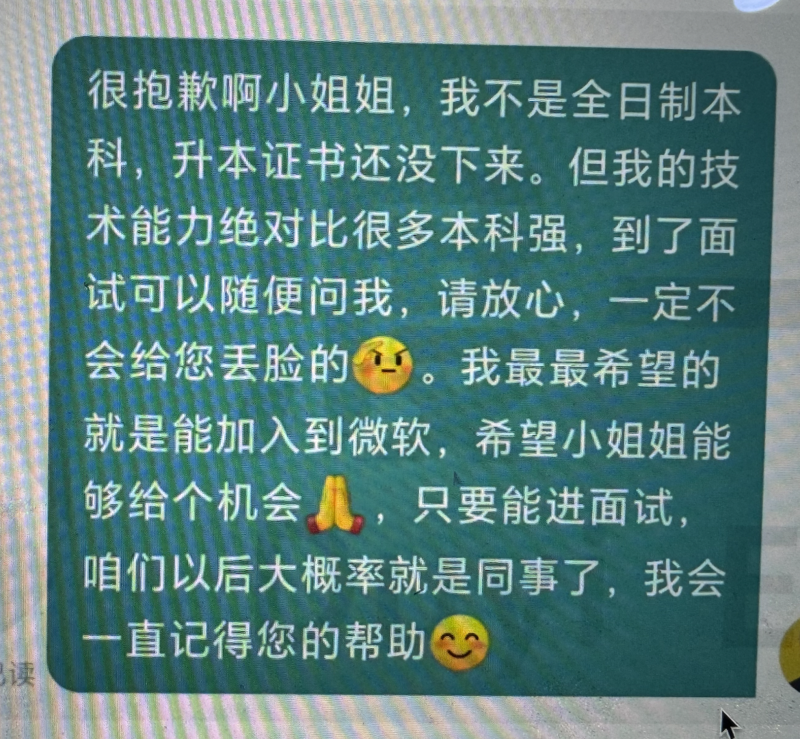

# 非技术环节

## 打招呼

开场 + 匹配岗位的理由（可修改的） + 期待回复 + 祝福

- 可修改的：针对岗位特殊的需求（例如可视化），要修改话术，给人的感觉是现场回复的，而不是群发的

## 已读不回

- 不要我的简历

- 简历投递过去没有约面试

解决方案：隔两三天再发 + 开场 + 缩小时间窗口（造成紧迫感） + 求回复 + 祝福

## 自我介绍

- 表达的时候要自然

- **让面试官认识到自己的能力**

- **让面试官认知到自己的意愿**

- 让面试官感到亲切

- 引导面试官提问

开场 + 意愿 + 能力 + 夸赞 + 问题

```
中低端岗： 开场 + 意愿 + 能力 + 夸赞 + 问题

面试官您好，我叫XXX，目前在前端这个领域有x年经验。

之前有过X份工作经历，不过我这一次我希望找到一个业务能够一直深耕下去，和公司一同成长。

所以这一次投递简历我是认真看了公司的招聘要求和业务范围后才投递的。

因为咱们公司是专业做低码平台的，这恰好也是我一直想做的事。

之前的工作当中没有机会接触到这部分业务，更多的是一些传统的业务开发，除了最近两个项目有些比较复杂问题需要处理，其他的项目大多数时候其实像是一个体力活。

因此我在工作之余，都是尽量的抽出时间自己去积累一些东西，特别是关于浏览器和前端框架的一些底层原理上，我还是花费了很多的精力去专研的。

有这些基础能力在，我相信这个业务我虽然没有接触过，我也能够在短时间内迅速的上手。

当然，如果我能加入进来，以后肯定要多跟你讨教，还要向您多学习。

嗯，我的大体情况就是这样了，看面试官还想了解哪些？
```

## 为什么离职？

不能是能力问题，也不是态度问题。

表述结构：肯定 + 否定 + 理解

```
那家公司吧其实其他都挺好，领导对我也很好，同事关系也很好，就是对个人发展来说太受限了。因为公司里面很多人都是在混日子，很多问题都是能拖则拖，就算解决也是应付了事，其实好多问题bug都是没解决干净的，好多时候都是我去提出来，然后我去负责处理，我都快成公司的劳模了。

所以我就担心啊，一直在那里待下去会不会有一天自己也变成了那样的人。所以思虑再三，还是出来了。当时我把最后一次版本迭代完成后，就把工作交接了。其实后续还陆陆续续的有一些BUG其他同事解决不了，为这个后来我还专门跑去公司了几趟，又帮他们写了一些规范文档，梳理了一下整个技术结构，现在都没啥问题了。

就是这个问题，其他都挺好，之前的同事都还有联系，有时候给他们推荐一些技术文章，也有约出来吃个饭啥的，就是这个散漫的工作氛围我实在不能久待，其实就是这个问题。
```

## 是否接受加班

肯定 + 期望 + 理解

```
加班很正常，没问题。

但是呢，我还是希望加班能有加班工资，这也是对我劳动的肯定，同时呢，也希望没有那种无意义的加班，有些公司呢，是为了加班而加班，其实大家都在加班摸鱼，这样的加班其实无论是对员工还是对公司我认为都不太好。

当然，每个公司有自己的难处，确实有困难，需要大伙努把力、加把劲，我也能理解，反正有事一起担，有压力一起扛，没啥问题。
```

## 期望薪资

- 弱势

- 强势

```
是这样，我谈一下我的情况，xxx公司和xxx公司我也面了，其中一家能给我xxx（你期待的150%），另一家还在看我意向 讲实话，我还是非常想来咱们公司的，这的氛围和文化，以及技术前景和团队素养，我都非常喜欢，如果咱们能给我下offer的话，不低于xxx（你期待的110%~120%）我就可以接受
```

## 缺点是什么？

对自我有认识，对问题有办法。

## 职业规划

- 主线（技术栈）

    - 业务开发 ==> 基建架构（为其他岗位赋能）==> Leader 技术管理岗 ==> 系统架构师（全栈，前提是前端毕业）

- 支线（非技术栈）

如何表达？

1. 学习有方向、有依靠

2. 工作有动力、有目标

```
我的目标是首先能够成为前端架构师。技术方面我一直以来也在不断积累，比方说之前自学的XXX、XXX其实都是在为这个目标去做沉淀。另外经验和实践方面，那以后只能仰仗面试官您了，以后您有空的时候，还希望不吝赐教。

当然，肯定得从一个大头兵开始干，跟着公司一起成长发展。咱们边干边沉淀，随着自己的积累，随着咱们公司的业务不断发展，我相信将来有机会让我尝试更有挑战的工作。我要干得好，可以让我试试，要干得不好，我继续埋头苦练就是了，都能理解。
```

## 同事关系

一定要从企业的角度去考虑问题。

## 问考官

可以体现职业素养，可以做人情世故。

尽量要到面试官的微信。

- 有个不情之请，不管今天的结果如何，希望添加您的微信日后可以交流技术，向您学习（不方便也要表示理解）

## 学历问题

- 学历问题肯定要说明，但是要尽量靠后。

- 内容上要轻说，淡说。

### 沟通环节

一定不能主动说。

如果被问到：



### 面试环节

满足以下条件才可以主动说：

- 上一个环节没说

- 整个面试过程氛围很好

即便要说也要在面试完成后。

```
对了，面试官/张哥，还有个事儿我跟您汇报一下，就是我的学历不是全日制的本科，但请放心，我的工作能力肯定没问题。

就是不知道咱们公司对这一块是不是有规定，如果有规定的话您看到时候能不能通融通融，因为这一块我想改变我也确实改变不了。
```

### 入职环节

必须是之前的环节没有说过，一定要尽快主动的说。

入职之前和 HR 维护好关系。

```
对了小姐姐有个事我一直想跟你说，这两天忙没顾上。就是我的学历不是全日制的本科，升本的证书一时半会儿还下不来。我之前的公司不在意这个所以我一直也没怎么关注，最近我朋友跟我说现在很多企业都要过问一下学历，所以我跟你汇报一下这个情况，别到时候影响你的绩效什么的。

不过我的工作能力绝对没问题，肯定不会让你失望，而且我一直都特别希望能够加入XX，能够跟您和面试官成为同事，我觉得你们对我都挺好。

所以，如果咱们公司如果卡的不是特别严格的话，还希望您能够帮忙通融通融，永远感激，如果影响你业绩了那我必须双倍补上。
```

## 工作问题

### 问到公司业务

### 离职证明