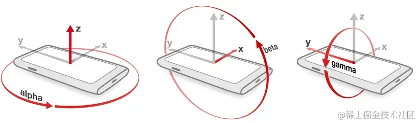

# deviceorientation

只有带有陀螺仪的设备才支持体感。

仅在 HTTPS 协议下生效。



-   Alpha：设备围绕 Z 轴旋转的角度，范围从 0 到 360 度。当设备水平放置时，Alpha 为 0 度，当设备顺时针旋转时，Alpha 值逐渐增加。

    -   0 的时候指北，180 指南；

-   Beta：设备围绕 X 轴倾斜的角度，范围从-180 到 180 度。当设备水平放置时，Beta 为 0 度，当设备向前倾斜时，Beta 值逐渐减小。

    -   手机平放的时候值为 0，如果手机立起来（屏幕朝人）值为 90，屏幕叩向桌面的时候值为 180

-   Gamma：设备围绕 Y 轴倾斜的角度，范围从-90 到 90 度。当设备水平放置时，Gamma 为 0 度，当设备向右倾斜时，Gamma 值逐渐增加。

```js
if (window.DeviceOrientationEvent) {
    window.addEventListener('deviceorientation', function (event) {
                console.log(event);
                document.getElementById('root').innerHTML =
                    'alpha: ' + event.alpha + '<br>' +
                    'beta: ' + event.beta + '<br>' +
                    'gamma: ' + event.gamma;
                // event.alpha 绕X轴旋转的角度（水平向右为正）
                // event.beta 绕Y轴旋转的角度（垂直向下为正）
                // event.gamma 绕Z轴旋转的角度（垂直屏幕为正）
            });
} else {
    alert('你的浏览器不支持DeviceOrientation');
}
```
