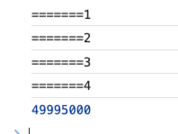

# woker

JS 都是单线程的，但是 woker 是开启多线程的，是真的多线程的，不是伪多线程。

woker 的限制：

-   不能操作 DOM

-   没有 window 对象

-   不能读取文件

-   可以请求 ajax

-   可以用于计算

```js
// index.js

// 页面的东西就是主线程
console.log('=======1');
console.log('=======2');

var a = 10000;
var woker = new Worker('worker.js');
woker.postMessage({
    num: a
});
woker.onmessage = function (e) {
    console.log(e.data);
};

console.log('=======3');
console.log('=======4');
```

```js
// worker.js

// 子线程
this.onmessage = function (e) {
    var result = 0;
    for (var i = 0; i < e.data.num; i++) {
        result += i;
    }
    this.postMessage(result);
};
```



主线程先执行，子线程后执行！

在 worker 内能否继续创建 worker 呢？理论上可以，实际上浏览器都不支持。