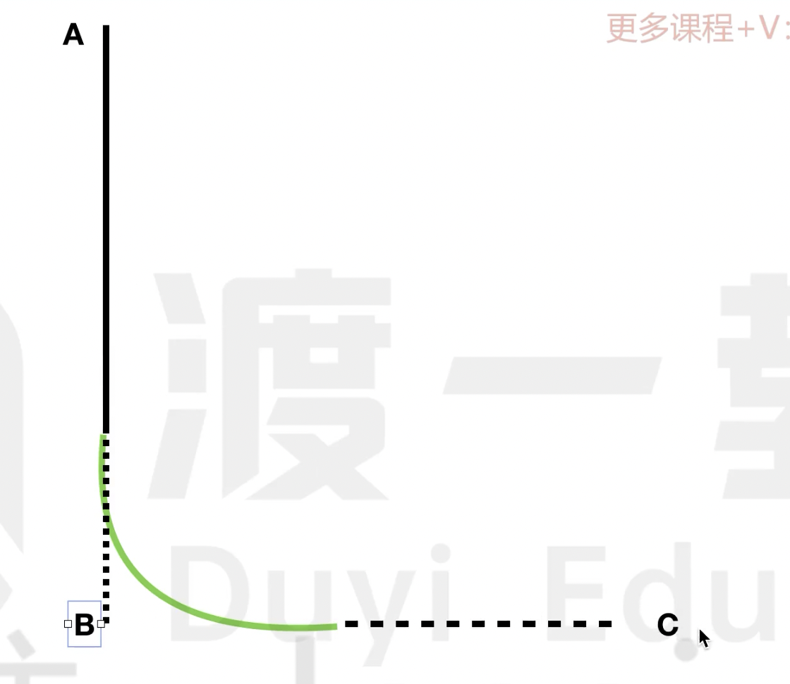

# canvas

```html
<canvas style="border: 1px solid #333" id="canvas" width="500px" height="500px"></canvas>
```

画布标签，相当于一个画板区域，主要是通过 JS 来进行绘画操作。

### 画线

```js
/* var oCanvas = document.getElementById('canvas');
// 获取画布上下文
var ctx = oCanvas.getContext('2d');
// 选择一个起点
ctx.moveTo(100, 100);

// 画一条线
ctx.lineTo(200, 100);
ctx.lineTo(200, 200);
// 闭合路径 类似于 ctx.lineTo(100, 100);
ctx.closePath();

// 填充颜色
// ctx.fill();

// 设置线条的宽度，相当于对所有的线条生效
// 这里有个概念：
// 虽然调用了两次 lineTo 方法，但是相当于一笔画成的图形，如果想要开启新的笔迹，需要调用 beginPath()
ctx.lineWidth = 5;

// 进行绘画
ctx.stroke(); */

// TODO:====================
var oCanvas = document.getElementById('canvas');
var ctx = oCanvas.getContext('2d');

ctx.moveTo(100, 100);
ctx.lineTo(200, 100);
ctx.stroke();

// 开始新的路径
ctx.beginPath();
ctx.moveTo(200, 100);
ctx.lineWidth = 5;
ctx.lineTo(200, 200);
ctx.lineTo(300, 200);

// 无效，因为是针对一笔完成的路径，现在是两笔完成的路径
// 只针对当前的 path 进行闭合
ctx.closePath();

ctx.stroke();
```

### 画矩形

lineTo() 方法也可以画一个矩形，但是这样的方式比较麻烦。

```js
var oCanvas = document.getElementById('canvas');
var ctx = oCanvas.getContext('2d');

// // 画矩形（x，y，width，height）
// ctx.rect(100, 100, 150, 150);
// // 填充
// ctx.fill();
// ctx.stroke();

// 绘制并填充一个矩形
// ctx.strokeRect(100, 100, 200, 100);

// 绘制一个矩形
ctx.fillRect(100, 100, 200, 100);
```

### 画圆形

```js
// 圆心（x，y） 半径（r） 弧度（起始，结束） 方向（顺时针，逆时针）

var oCanvas = document.getElementById('canvas');
var ctx = oCanvas.getContext('2d');

// ctx.arc(200, 200, 100, 0, 2 * Math.PI, false);
ctx.arc(200, 200, 100, 0, 1.3 * Math.PI, false);
ctx.lineTo(200, 200);
ctx.closePath();
ctx.stroke();
ctx.fill();
```

### 画圆角矩形



```js
var oCanvas = document.getElementById('canvas');
var ctx = oCanvas.getContext('2d');

ctx.beginPath();
ctx.moveTo(100, 100);
// B(x, y) C(x y) 圆角的大小
// C点只提供一个方向，没有具体的实际展示出来的线段
ctx.arcTo(100, 200, 200, 200, 10);
ctx.arcTo(200, 200, 200, 100, 10);
ctx.arcTo(200, 100, 100, 100, 10);
ctx.closePath();
ctx.fill();
ctx.stroke();
```

### 贝塞尔曲线

```js
var oCanvas = document.getElementById('canvas');
var ctx = oCanvas.getContext('2d');

// 单次贝塞尔曲线
// ctx.beginPath();
// ctx.moveTo(100, 100);
// ctx.quadraticCurveTo(200, 200, 300, 100);
// ctx.stroke();

// 三次贝塞尔曲线
ctx.beginPath();
ctx.moveTo(100, 100);
ctx.bezierCurveTo(200, 200, 300, 100, 400, 200);
ctx.stroke();
```

### 坐标平移旋转和缩放

ctx.rotate(Math.PI / 6); 是根据画布的原点进行旋转的。

ctx.translate(100, 100); 更改坐标系的原点。

```js
ctx.beginPath();
ctx.translate(100, 100);
ctx.rotate(Math.PI / 6);
ctx.moveTo(0, 0);
ctx.lineTo(100, 0);
ctx.stroke();
```

缩放，ctx.scale(2, 2); 表示对 x 的坐标 _ 2，对矩形的宽度 _ 2

也就说矩形的坐标和宽度都会变化

```js
var oCanvas = document.getElementById('canvas');
var ctx = oCanvas.getContext('2d');

ctx.beginPath();
ctx.moveTo(100, 100);
ctx.scale(2, 2);
ctx.strokeRect(100, 100, 100, 100);
```

### save & restore

```js
var oCanvas = document.getElementById('canvas');
var ctx = oCanvas.getContext('2d');

ctx.beginPath();
ctx.save(); // 存储当前的坐标平移、旋转、缩放状态，写在这里也就是说无平移，无旋转、无缩放！
ctx.translate(100, 100);
ctx.rotate(Math.PI / 4);
ctx.translate(100, 100);
ctx.rotate(Math.PI / 4);
ctx.strokeRect(0, 0, 100, 50);

ctx.beginPath();
ctx.restore(); // 恢复到之前保存的坐标评议和旋转状态
ctx.fillRect(200, 0, 100, 50);
```

### 背景填充

```js
var oCanvas = document.getElementById('canvas');
var ctx = oCanvas.getContext('2d');

var img = new Image();
img.src = './demo.jpg';
img.onload = function () {
    ctx.beginPath();

    // 填充图片背景
    var bg = ctx.createPattern(img, 'no-repeat');
    ctx.fillStyle = bg;

    // ctx.fillStyle = "red"; // 填充颜色
    ctx.fillRect(100, 100, 200, 100);
};
```

默认是以坐标系原点的位置开始填充的！

使用 ctx.translate 来更改坐标系的原点。

### 线性渐变

```js
var oCanvas = document.getElementById('canvas');
var ctx = oCanvas.getContext('2d');

ctx.beginPath();
var bg = ctx.createLinearGradient(0, 0, 500, 500);
// 取值 0~1 之间
bg.addColorStop(0, 'red');
bg.addColorStop(0.5, 'blue');
bg.addColorStop(1, 'white');
ctx.fillStyle = bg;
ctx.fillRect(0, 0, 500, 500);
```

线性渐变的起始点还是坐标系的原点。

### 辐射渐变

```js
var oCanvas = document.getElementById('canvas');
var ctx = oCanvas.getContext('2d');

ctx.beginPath();
// (x1, y1, r1, x2, y2, r2)
var bg = ctx.createRadialGradient(100, 100, 50, 100, 100, 100);
bg.addColorStop(0, 'red');
bg.addColorStop(0.5, 'blue');
bg.addColorStop(1, 'white');
ctx.fillStyle = bg;
ctx.fillRect(0, 0, 200, 200);
```

也就是从起始圆的边向结束圆的边进行渐变。

### 阴影

```js
var oCanvas = document.getElementById('canvas');
var ctx = oCanvas.getContext('2d');

ctx.beginPath();

ctx.shadowColor = 'red';
ctx.shadowBlur = 15; // 阴影大小
ctx.shadowOffsetX = 10; // 阴影水平偏移量
ctx.shadowOffsetY = 10; // 阴影垂直偏移量

ctx.strokeRect(100, 100, 200, 200);
```

### 渲染文字

```js
var oCanvas = document.getElementById('canvas');
var ctx = oCanvas.getContext('2d');

ctx.beginPath();
ctx.font = '50px 苹方';
// strokeText 相当于文字描边
ctx.strokeText('有理想', 200, 100);

// fillText 相当于普通的文字
ctx.fillStyle = 'red';
ctx.fillText('youlixiang', 300, 200);
```

### 线端样式

```js
var oCanvas = document.getElementById('canvas');
var ctx = oCanvas.getContext('2d');

ctx.beginPath();
ctx.lineWidth = 15;
ctx.moveTo(100, 100);
ctx.lineTo(200, 100);

// butt（默认）、round、square
// square 和 butt 很相似，只是在 butt 的基础上左右两端都加上了一个方块
ctx.lineCap = 'round';

ctx.stroke();
```

```js
var oCanvas = document.getElementById('canvas');
var ctx = oCanvas.getContext('2d');

ctx.beginPath();
ctx.lineWidth = 15;
ctx.moveTo(100, 100);
ctx.lineTo(200, 100);
ctx.lineTo(100, 150);
// round、bevel、miter（默认）
ctx.lineJoin = 'miter';
ctx.stroke();
```