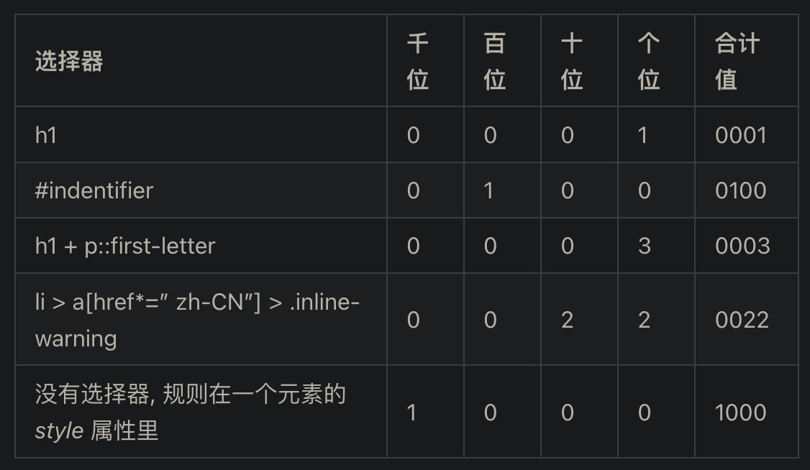

# 层叠和继承规则总结

## 层叠规则

CSS 就是层叠样式表，层叠的概念比较重要。

选择器的样式取决于三个因素：

- 重要性

- 专用性

- 源代码次序

### 重要性

`!import`

万不得已的情况下不建议使用这个属性。

### 专用性

选择器的权重。

选择器能匹配多少元素，匹配的越少，权重越高。

- 元素/伪元素/属性选择器 < 类/伪类选择器 < ID选择器 < 行内样式

### 源代码次序

如果权重一样，则看源代码的次序。

## 继承

- inherit

- inital

- unset

- revert

### 就近原则

继承最近的父元素。