# DOM

通过 DOM 就可以操作 DOM 了，DOM 就是一个对象，对应 HTML 中的节点。

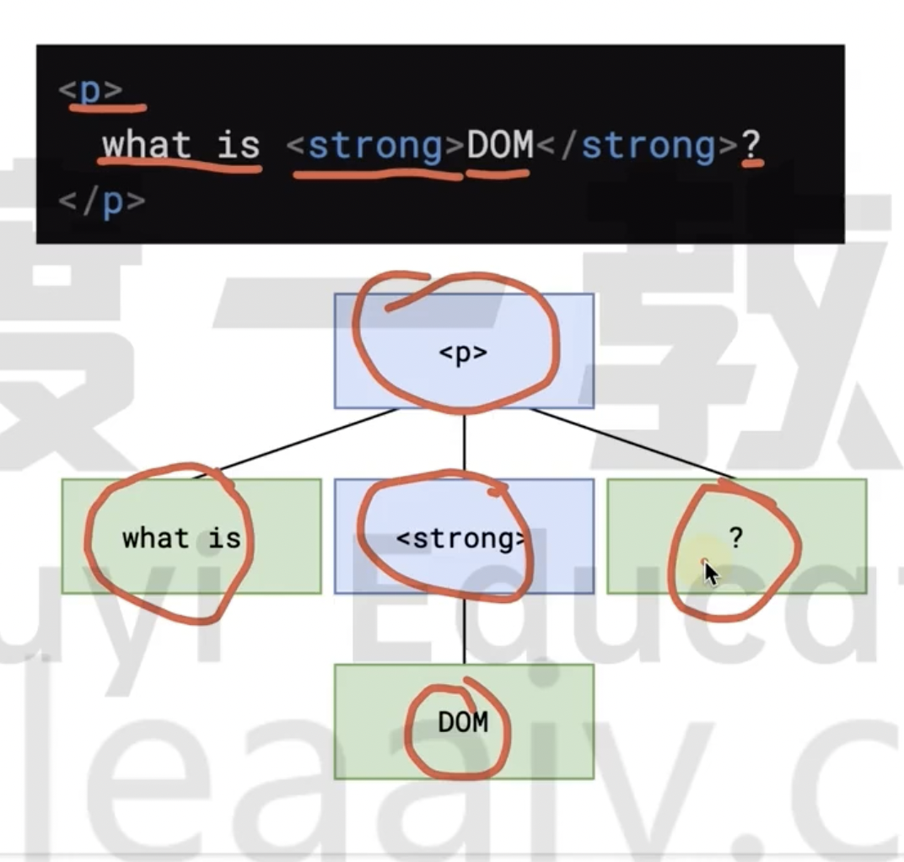

文字也是节点，叫做文本节点。

## 获取 DOM

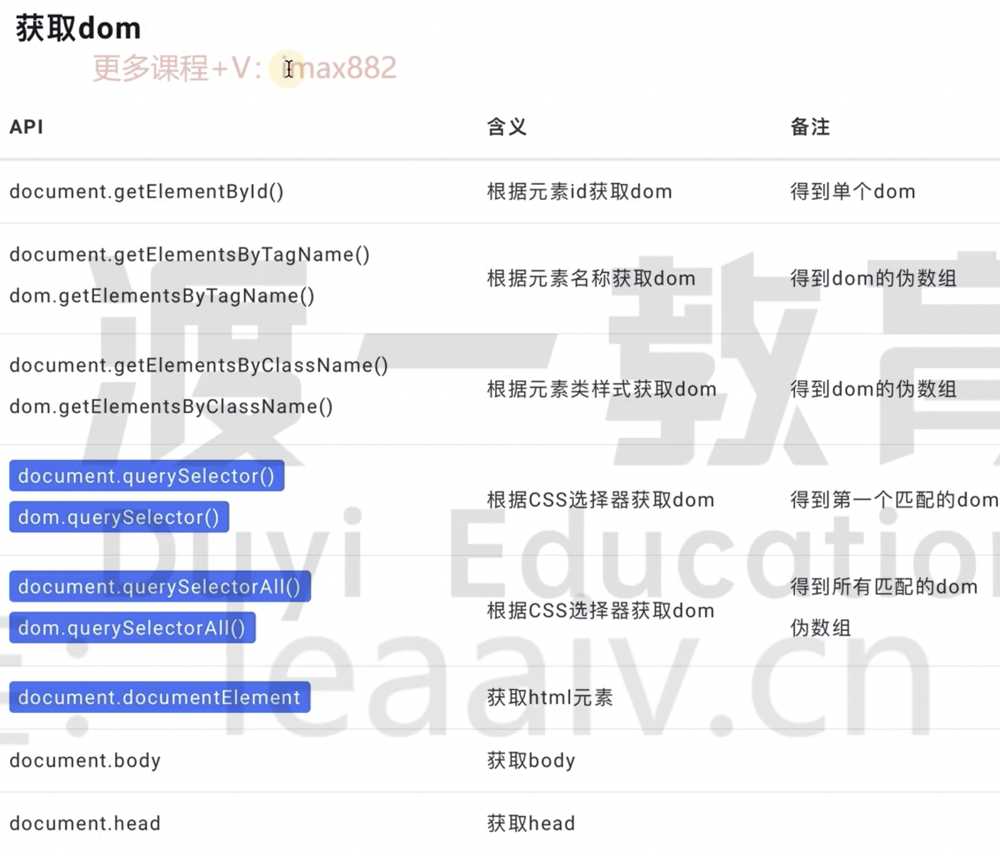

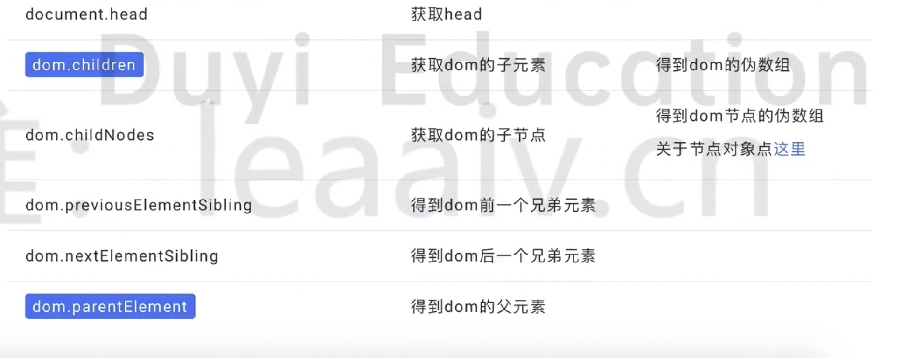

（蓝色表示常用的 API）

document 是 window 对象中的一个属性，可以直接使用不需要 window. 来调用，表示整个文档。

document 其实就是一个 dom（特殊的 dom），用哪一个 dom 调用 getElementsByTagName，就是获取哪一个 dom 下的元素。

dom.getElementsByTagName() 就是在 dom 下获取元素。

dom.children 和 dom.childNodes 区别：

- children 只能获取元素节点，不能获取文本节点。

- childNodes 不仅可以获取元素节点，还可以获取文本、注释等节点。

## 创建 DOM

新创建的 DOM 还没有在 DOM 树中，需要插入到 DOM 树中，此时拿到的就是个 dom 对象。

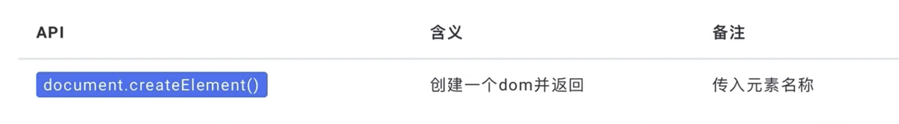

## 更改 dom 结构

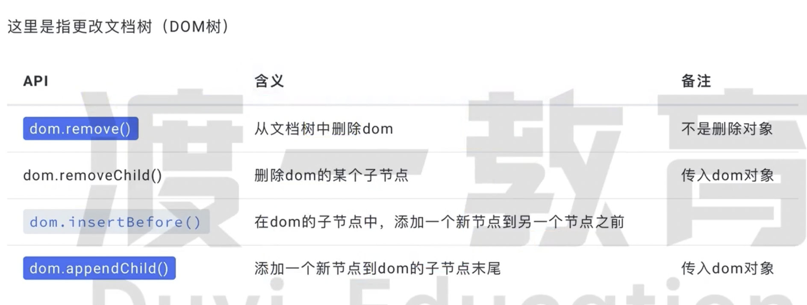

- remove() 只是从 dom 树中删除了，但是 dom 这个对象还是在的，还可以加入回去

## dom 属性

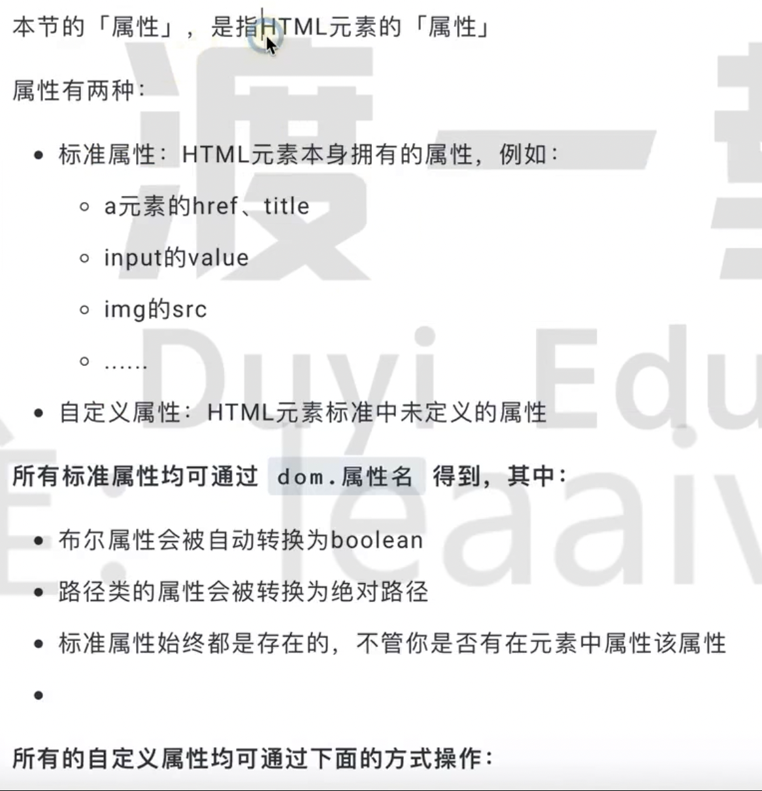

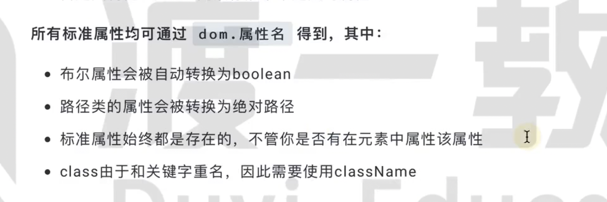

属性认为有两种：标准属性和自定义属性。

标准属性都可以用 dom. 来进行获取和设置。

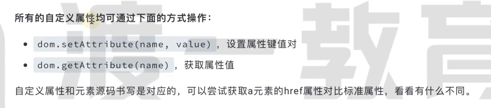

如果使用 getAttribute() 来获取标准属性，获取到的内容和源代码是一致的，例如 checked 的道的依旧是 "checked"，而不是 true。如果获取源代码上没有写的标准属性，得到的就是 null。

## dom 内容

可以获取也可以更改。

innerText 在设置标签的时候会自动将 <> 转换成 &lt; &gt;

innerHTML 在设置的时候不会自动转换。

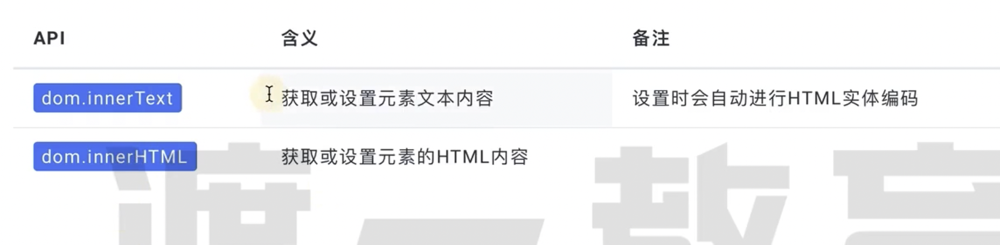

## dom 样式

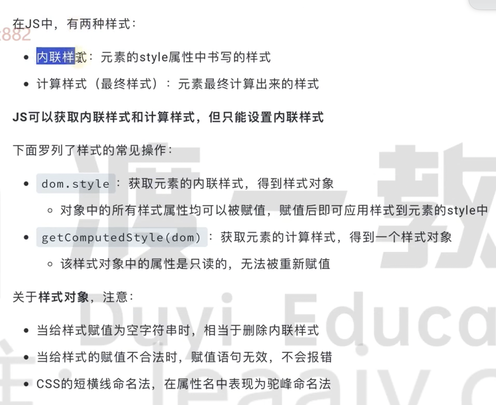

计算样式是浏览器最终计算出的样式。

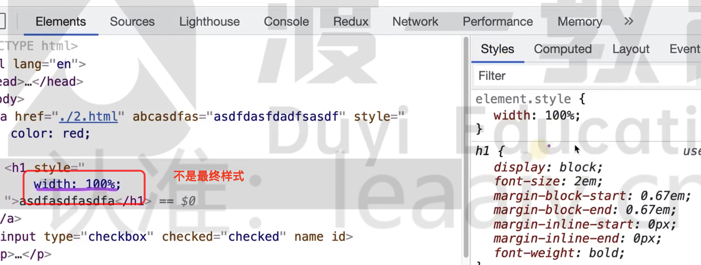

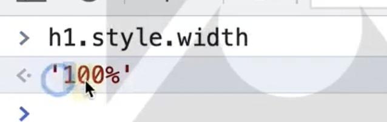

可以获取内敛样式和计算样式，但是只能设置内敛样式。

- dom.style

css 短横线命名全部变成小驼峰。

- getComputedStyle(dom) 只读属性。

