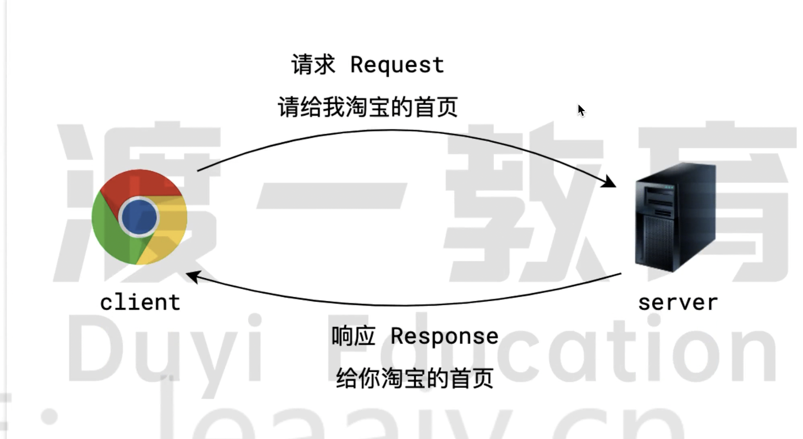

# 网络的基本概念

## 客户端和服务器

在网络中，两个应用程序之间会经常发生通信。

发出信息的一方成为客户端 client，发出信息的过程称为 request

回复信息的一方成为服务器 server，回复信息的工程称为 response

注意点：

- 不管是客户端还是应用程序，都是一个应用程序，而不是计算机

- 客户端和服务器的这种交互模式被称为c/s结构，如果客户端是浏览器则可以称为b/s结构