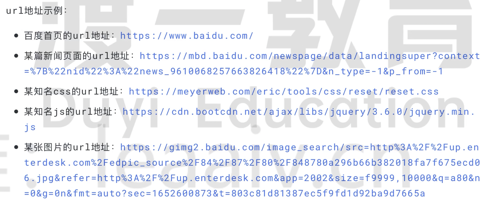
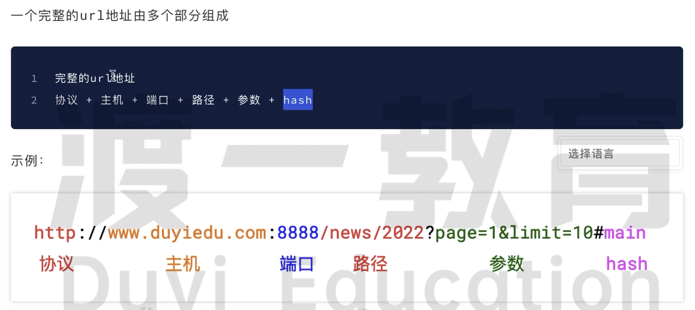

# 基本概念url

要完成一次请求，首先要让客户端找到服务端。

在互联中我们通过 url 来找到我们想要的资源。

url 全称 uniform resource locator, 统一资源定位符。是一个字符串，用来表达互联网中某个资源的位置。

## 协议 Protocal / Schema

表示客户端希望用什么方式和服务端进行沟通。

https 比 http 协议更加的安全。

## 主机 Host

表示客户端希望在那台计算机上寻找资源。

两种写法：ip 或域名。

IP 地址：是网络中计算机的唯一编号。通常一个ip对应一台计算机。

- 特殊的 IP 地址：127.0.0.1，表示本机的 IP

域名：域名类似于 ip 的别名，比 ip 地址更加容易记忆，最终域名还是会转化为 ip 地址。

- 特殊的域名：localhost

## 端口 Port

表示客户端希望在哪个应用程序中寻找资源。

类似于一栋楼中有很多的房间，每个房间都有一个编号，这个编号就是端口。

只有找到了端口号才能找到对应的资源。

端口是可选的，若不写 http 协议默认端口是 80，https 协议默认端口是 443。

## 路径 Path

服务器上往往有许多的资源，每个资源都有自己的访问路径。

路径是可选的，如不写默认为 /

## 参数 Query / Param

某些资源可以根据需要呈现不同的内容，例如查询第几页就属于一些额外的信息，这些额外信息可以通过参数来实现。

`https://www.baidu.com?wd=学习网络&currentPage=1&pageSize=10`

> url 地址中是不能出现非 ASCII 字符的，如果出现会自动进行编码，只是浏览器方便浏览解析为中文的

## 哈希 Hash

没有太大的作用，往往作为浏览器的锚链接出现。