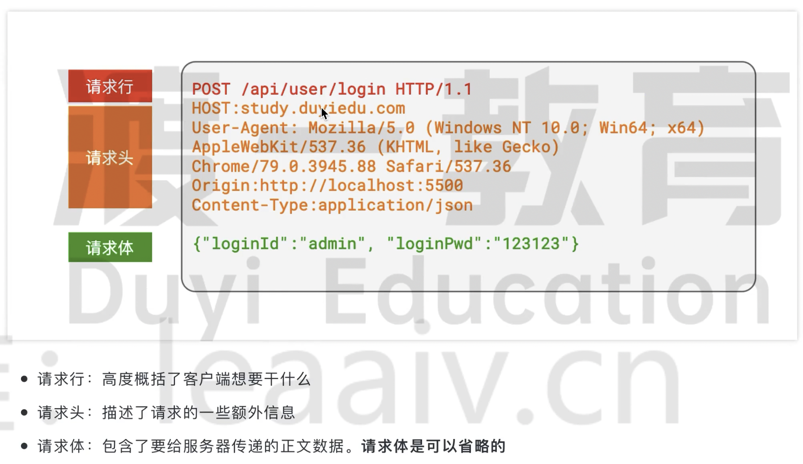
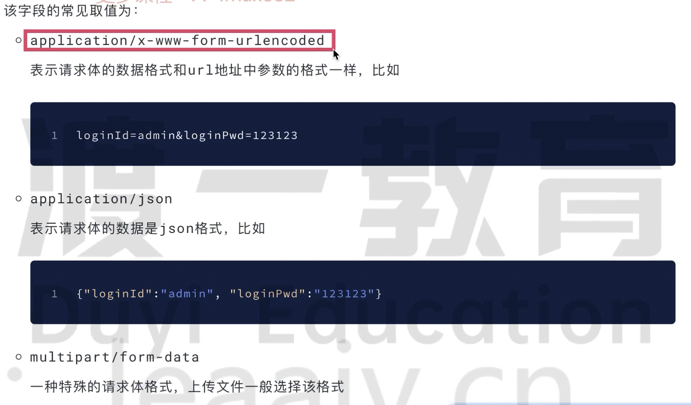
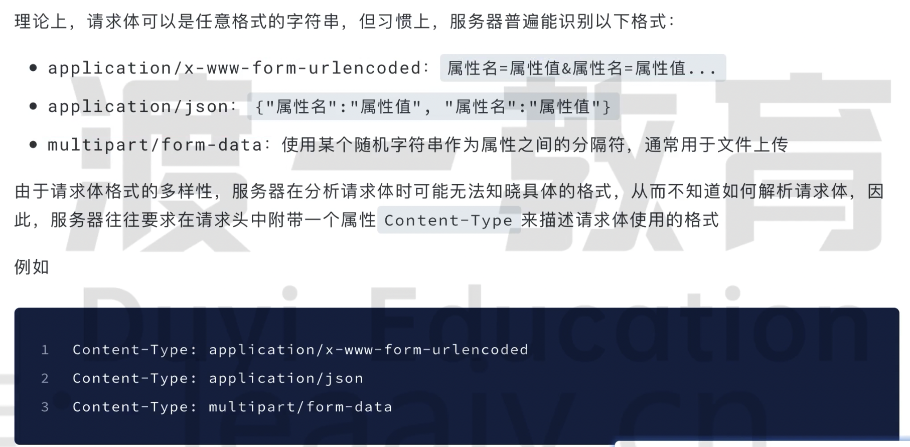
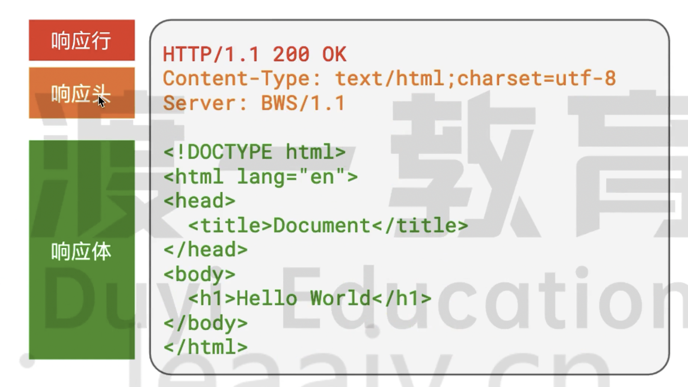
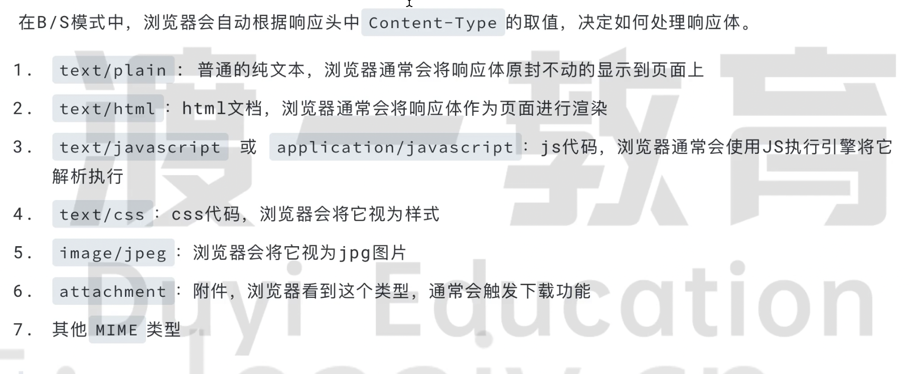

# http 协议

通过 url 地址能在茫茫的互联网中找到自己想要的服务。但是还需要一种共同的语言来进行对话，否则听不懂对方说的什么。

> https 是在 http 协议上发展起来的，他增加了安全性，其他和 http 协议完全一致。

http 协议规定：

- 每次请求和响应是独立的，相互之间不干扰，这种模式称为无状态协议。也就是不保留之前的状态，下一次在请求就不认识了；

- 请求请求响应的都是纯文本（字符串），文本格式必须按照 http 的协议规定的格式书写；

## 请求的格式

### 请求行

包含：请求方法、路径+参数、协议和版本。

- 请求方法表达了客户端的一个基本的动作：GTE 获取、POST 提交、PUT 修改、DELETE 删除

- GTE 和 DELETE 不能有请求体，POST 和 PUT 可以有请求体

- GET 没有请求体，所以需要把请求参数全部放在 url 上

- 浏览器自动发出的请求基本都是 GET 请求，而 POST 请求是需要开发者手动触发的

### 请求头

请求头是一系列的键值对，浏览器每次都会自动附带很多的请求头，其实这些请求头大部分服务器是不需要的。

常见的请求头：

- host 请求的主机地址

- user-agent 浏览器的信息

- content-type 请求体的消息格式，如果没有请求体这个属性则无意义

    - 值为 MIME 类型，标准格式的字符串来表达内容格式，常见的有：text/html、text/css、application/json、application/x-www-form-urlencoded

    - 

### 请求体

请求体的格式要和请求头中的 content-type 对应。

## 响应的格式

和请求基本一致。

### 响应行

- 协议版本

- 状态码、状态信息：表示服务器对当前请求的表态

状态码的分为：

常见的状态码有：

- 200 正常响应，请求成功

- 301 永久重定向，新地址放在响应头的 location 属性中

- 302 临时重定向，新地址放在响应头的 location 属性中

- 304 资源未修改，可以从缓存中读取数据

- 400 语义有错误

- 403 服务器拒绝访问

- 404 请求的资源不存在

- 500 服务器内部错误

### 响应头

和请求头一样都是键值对组成的。

- content-type：表示响应体的数据类型；

    - 

### 响应体

