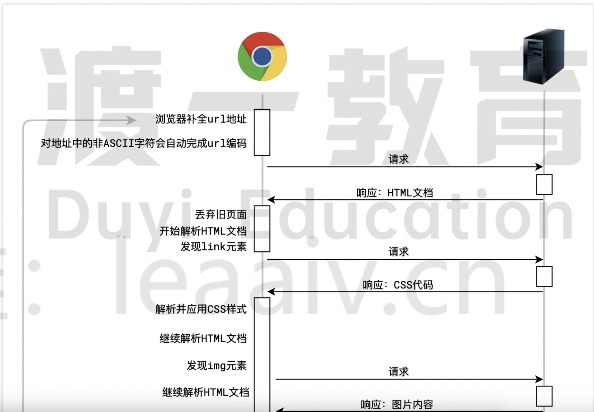
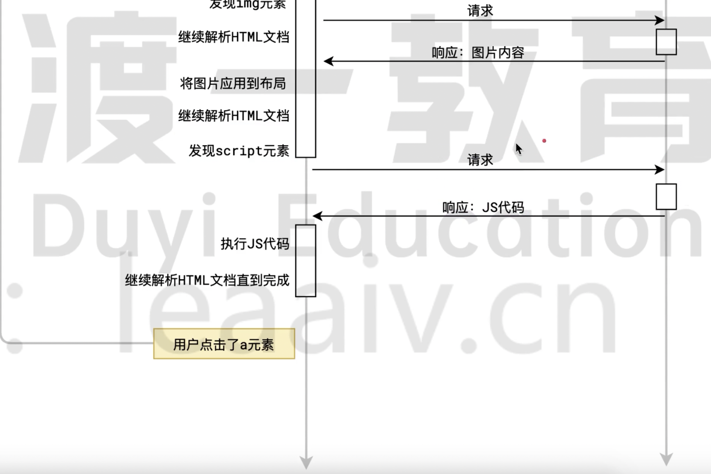

# 浏览器页面处理流程

服务的分类：

- 静态资源文件，就是服务器上的一个文件，例如图片、HTML、JS、CSS 文件等等；

- api 接口

**面试题：浏览器输入一个 URL 地址后，并按下回车会发生什么事情？**

- 简单版！！！

- 浏览器补全 url 地址

    - 补全协议

- 对非 ASCII 字符自动完成 url 的编码

- 发起 http 请求，请求方式为 GET

- 服务器响应结果，返回一个 HTML 文档

- 浏览器开始解析 HTML 文档，从上到下依次解析

- 遇到 link 标签，会请求 CSS 文件，会暂停 HTML 文档的解析！！！

- 服务器响应 CSS 代码

- 解析并应用 CSS 样式

- 继续解析 HTML 文档，遇到 IMG 元素，开始请求图片资源，不会暂停 HTML 文件的解析！！！

- 服务器响应图片资源

- 将图片应用在 HTML 页面上

- 发现 script 元素，开始请求 js 文件，会暂停 HTML 文档的解析！！！

- 服务器响应 JS 文件

- 解析并执行 JS 代码

- 继续解析，直到整个文档被解析完成

- 直到用户点击了 a 元素，根据 a 元素的 href 属性跳转到另外一个新的页面继续开始从头执行