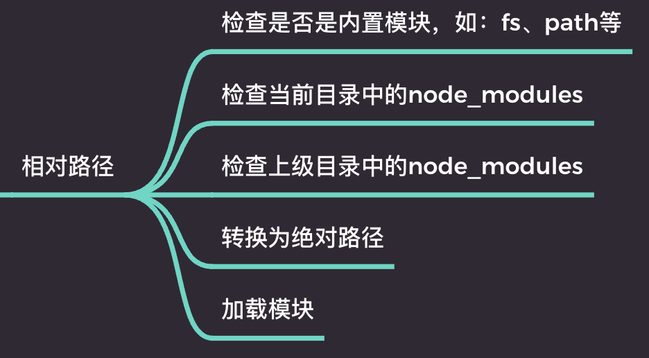
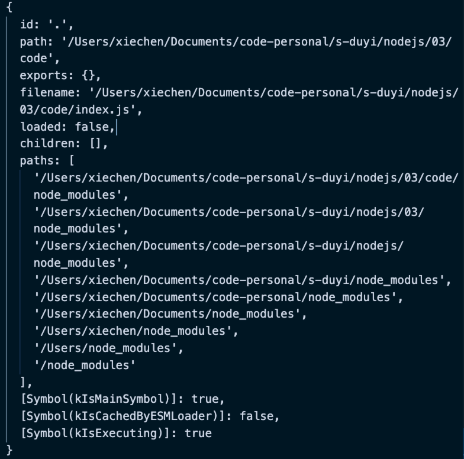
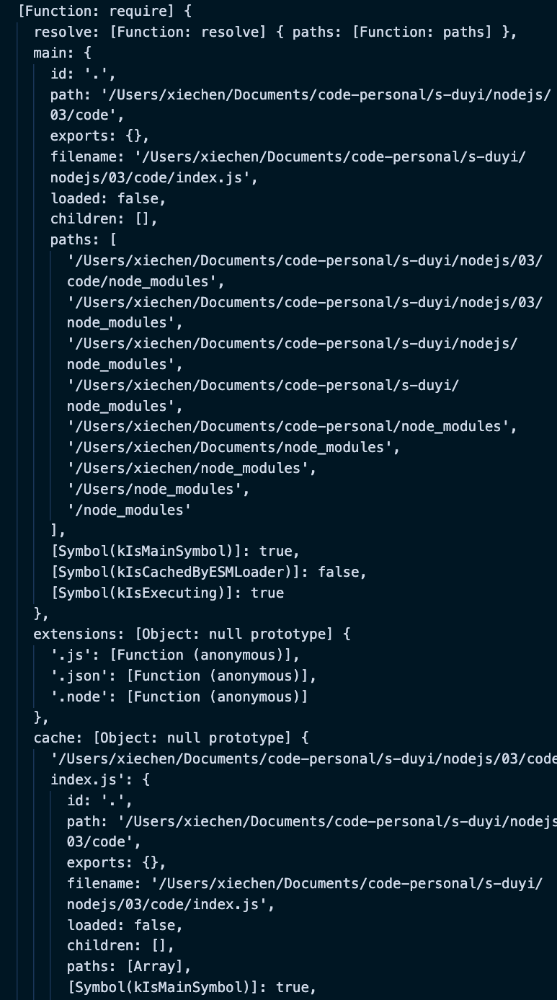

# NodeJS 的模块化的细节

## 模块的查找

`require(xxx)` 导入模块。

-   绝对路径

    -   `require("/Users/xiechen/Documents/code-personal/duyi/NodeJS/src/02/index.js");`

-   相对路径

    -   `require("../02/index.js");` 同样会转化为绝对路径，再加载模块

-   相对路径

    -   `require('packageName')`

    -   

-   后缀名

    -   

-   文件名

    -   

    -   ./src.js ./src.json ./src.node ./src/mjs ./src/index.js

    -   导入一个包的时候，优先 package.json 中的 main 字段为包的入口文件，默认为 index.js

## module 对象

记录当前模块对象信息

```js
console.log(module);
```



## require() 函数

```js
console.log(require);
```



-   require.resolve(path) 解析路径，返回一个绝对路径

    -  /Users/xiechen/Documents/code-personal/s-duyi/nodejs/03/code/a.js

-   require.main 返回入口模块

-   require.extensions 拓展名的处理函数

-   require.cache 缓存的模块

## 模块化的原理

```js
console.log(require('./myModule'));
```

```js
console.log('当前模块的路径：', __dirname);
console.log('当前模块的文件：', __filename);

/* 
// 案例一
exports.c = 3;
module.exports = {
  a: 1,
  b: 2
};
this.m = 5;
// 返回 { a: 1, b: 2 } 
*/

// 案例二
exports.c = 3;
exports.a = 1;
exports.b = 2;
this.m = 5;
// 返回 { c: 3, a: 1, b: 2, m: 5 }
```

require() 到底是如何导入模块的？以下都是伪代码！

```js
// 模拟写法
function require(mdulePath) {
    // 1、将 modulePath 转换为绝对路径，/Users/xiechen/Documents/code-personal/s-duyi/nodejs/03/code/myModule.js

    // 2、判断是否该模块已存在缓存，也就是 require.cache['模块的 ID']
    if (require.cache['模块的 ID']) {
        return require.cache['模块的 ID'];
    }

    // 3、读取文件的内容

    // 4、包裹到一个函数内，这就是为什么可以直接使用这些变量
    function __temp(module, exports, require, __dirname, __filename) {
        console.log('当前模块的路径', __dirname);
        console.log('当前模块的文件', __filename);

        this.m = 5;

        exports.c = 3;
        module.exports = {
            a: 1,
            b: 2
        };
    }

    // 5、创建 module 对象
    module.exports = {};
    const exports = module.exports;
    __temp.call(module.exports, module, exports, require, __dirname, __filename);

    // 
    return module.exports;
}
```
