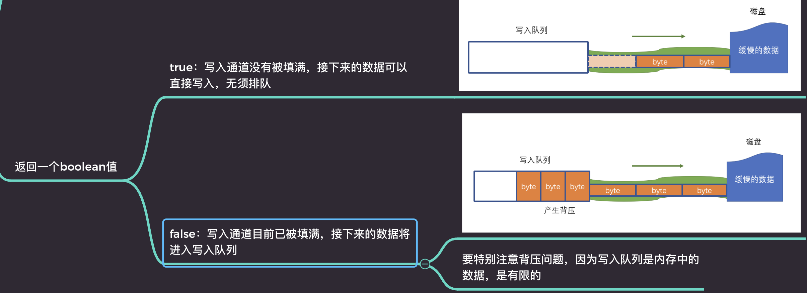

# 文件流-可写流

创建写入流：

```js
const ws = fs.createWriteStream(filename, {
    flags: 'a', // w覆盖文件 a追加文件
    encoding: 'utf-8', // 默认是 utf-8，如果是 null 需要写入 buffer
    highWaterMark: '2' // 每次最多写入的字节数
});
```

事件：

```js
ws.on("事件名", function(){ })
```

方法：

```js
const res = ws.write("测试写入");
```

返回一个布尔值



注意背压问题: 使用函数封装+drain 事件！

```js

let i = 0;
function write() {
    let flag = true;
    while (i < 1024 * 1024 * 10 && flag) {
        flag = ws.write('a');
        i++;
    }
}

write();
ws.on('drain', write);
```