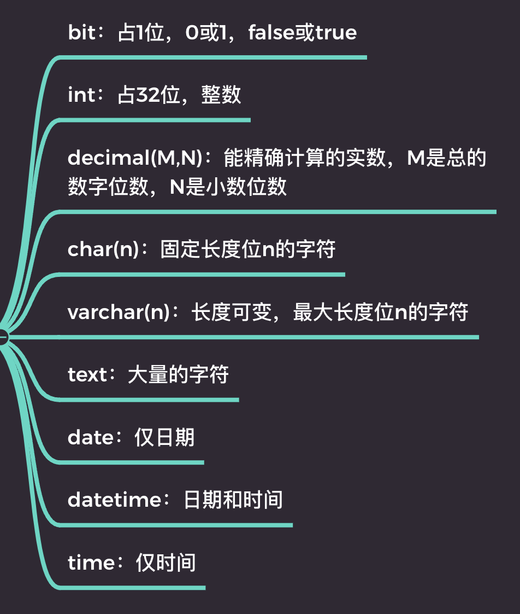
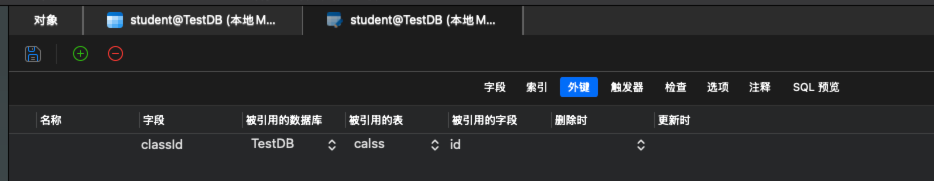
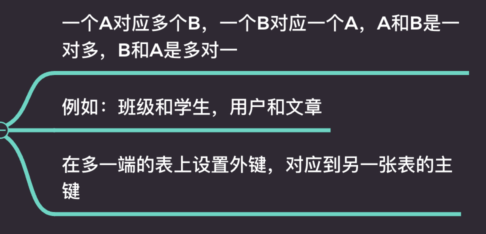

# 数据库设计

## SQL

结构化查询语言，属于申明式语言。

大部分关系型数据，拥有基本一致的 SQL 语法。

分支：

- DDL：操作数据库对象。

- DML：操作数据库数据（类似操作表中的行）。

- DCL：操作数据库权限。

## 管理库

辅助文档：https://www.runoob.com/mysql/mysql-tutorial.html

### 创建

CREATE DATABASE TestDB;

### 切换

USE TestDB;

### 删除

DROP DATABASE TestDB;

## 管理表（重点）

### 创建

- 字段

- 类型

常用类型：



- 是否为 null

- 自增 & 主键

- 默认值

SQL 语句：

```sql
CREATE TABLE `TestDB`.`student`  (
  `name` varchar(100) NOT NULL,
  `birthday` date NOT NULL,
  `sex` bit NOT NULL DEFAULT 1,
  `stuNo` int NOT NULL AUTO_INCREMENT,
	PRIMARY KEY (`stuNo`)
);
```

### 修改

### 删除表

```sql
DROP TABLE `TestDB`.`student`;
```

## 主键和外键

- 主键：每一个表都要有主键，主键是唯一的，用于表示每一条数据；

    - 唯一

    - 不可更改

    - 无业务含义

    - 同城命名为 id

- 外键：外键是表之间的关系，用于表示表之间的关系；



## 表关系

- 一对一


- 一对多



- 多对多


## 三大设计范式

