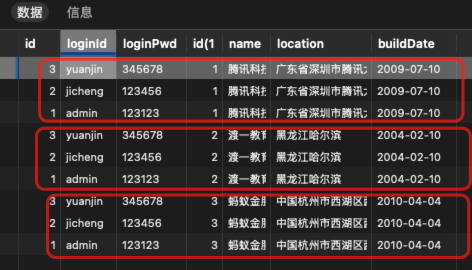

# 联表查询

## 全连接（笛卡尔集）

user 表中的每一条数据都对应 company 表中的每条数据（两张表的数据想乘）

```sql
SELECT * FROM `user`,company;
```



Team 表示例：


## 左连接

以左边的表为基准，右边的表和左边的表进行匹配，每次链接的时候判断条件是否满足。

```sql
-- 左链接
-- 部门表的第一行拿出来依次去判断员工表的每一行，看哪一行能满足条件
SELECT * FROM department as d LEFT JOIN employee as e ON d.id = e.deptId;
```

## 右连接

```sql
-- 右链接
SELECT * FROM employee as e RIGHT JOIN department as d ON d.id = e.deptId;
```

## 内连接（常用）

```sql
SELECT * FROM employee as e INNER JOIN department as d ON d.id = e.deptId;
SELECT e.`name`,joinDate,salary,d.`name` FROM employee as e INNER JOIN department as d ON d.id = e.deptId;
```

```sql
SELECT * FROM company as c
INNER JOIN department as d
	ON c.id = d.companyId
INNER JOIN employee as e
	ON d.id = e.deptId
```