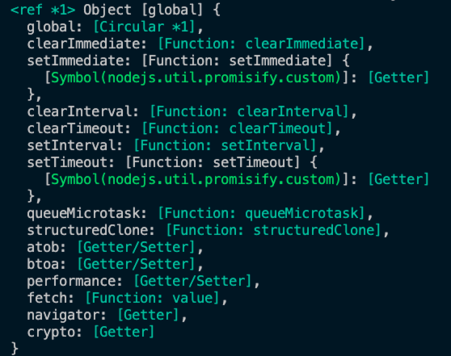
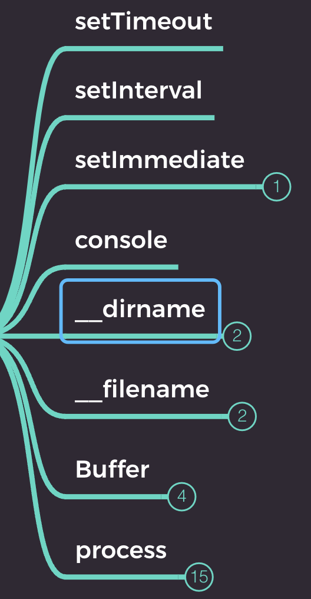
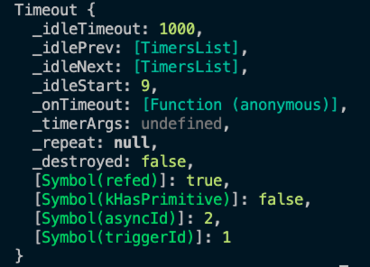
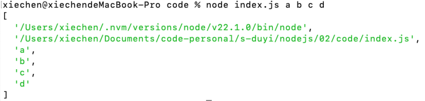

# 2.全局对象

Node 的全局对象：global

```js
console.log(global);
```



这些全局对象的属性可以直接调用。

global.global 是怎么回事？

相当于 global.global = global 这样的做法主要是为了访问自身。

## global 常用的属性：



- setTimeout

    - 和 window 对象不同，setTimeout 返回的是一个对象
    

- setImmediate，表示立即执行，相当于 setTimeout(() => {}, 0);

- console，输出

- __dirname 获取「当前模块」所在的目录路径

    - 该属性并非 global 的属性！！！

- __filename 获取「当前模块」所在的文件路径

- Buffer

    - 类型化数组

    - 继承自 UInt8Array

    - 计算机中存储的基本单位：字节

    - 使用时，输出时可能会用到十六进制

- process 进程对象，因为运行 node 的时候也相当于一个应用程序，程序在操作系统内占一个进程

    - cwd() 获取「当前命令行」所在的路径, 返回绝对路径

    - exit() 强制退出 Node 的进程

        - 可以传递一个退出状态码，默认为 0，无错误

```js
setTimeout(() => {
    console.log('setTimeout');
}, 3000)

process.exit();
```

- argv 获取命令中的参数

    - 

- platform 返回当前设备的操作系统

- kill(pid) 用于杀死进程，类似于在任务管理器退出进程

- env 获取电脑的环境变量