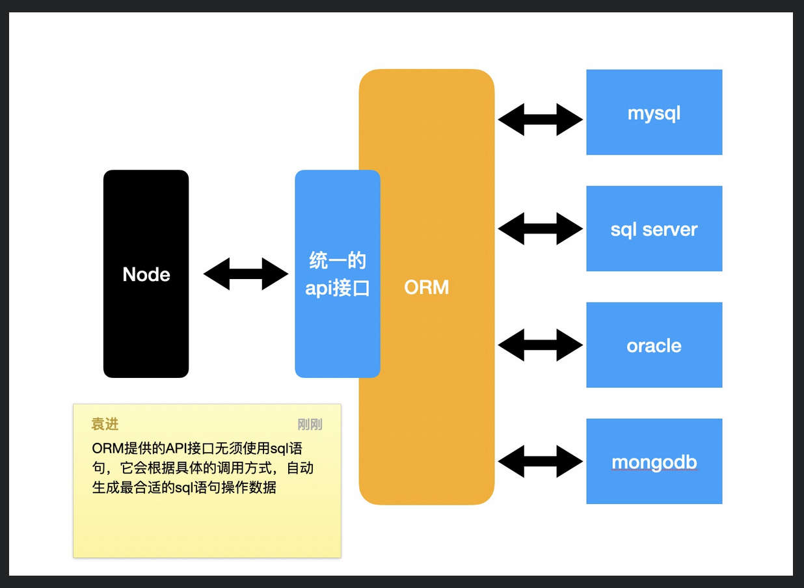

# Sequelize简介

直接使用 mysql2 驱动程序的问题。

## ORM

对象关系映射。

ORM 可以把对象和数据表进行关联。

隐藏具体的数据库底层细节。

操作数据库不使用 SQL 语句，而是 ORM 提供的 API。

优势：

- 不关心数据库

- 迁移

- 精确查询

    - 根据 api 自动生成 SQL 语句

## Node 中的 ORM

- sequelize(成熟)

    - JS 和 TS 都支持

    - https://github.com/sequelize/sequelize

    - https://github.com/demopark/sequelize-docs-Zh-CN

- typeORM(不成熟)

    - 只支持 TS