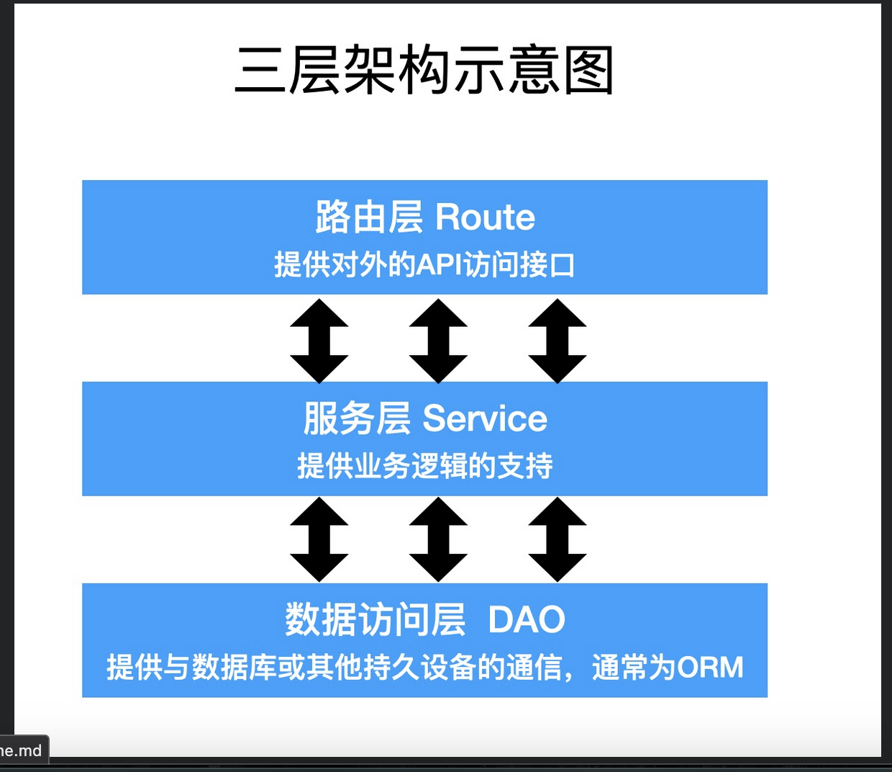

# 模型的增删改

## 三层架构

什么是三层架构？

后端功能分块。

- 路由层（api层/前端层），对外提供 API 接口

- 服务层，提供业务逻辑的支持

- 数据访问层，与数据库的通信（通常使用 ORM 框架）



## 新增数据

```js
const Admin = require("./modules/admin");

/* // 构建模型实例
const instace = Admin.build({
    loginId: "admin",
    loginPwd: "admin",
    name: "超级管理员"
});

// 调用 save() 方法保存到数据库
instace.save().then(() => {
    console.log("数据添加成功");
}); */

Admin.create({
    loginId: "admin2",
    loginPwd: "admin2",
    name: "超级管理员2"
}).then(() => {
    console.log("数据添加成功");
});
```