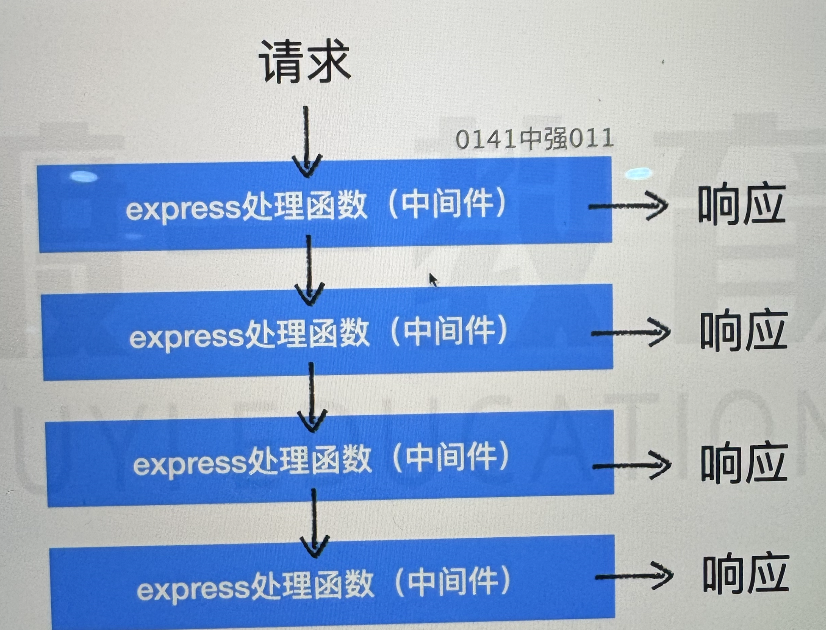

# 中间件



中间件就是一个一个的处理函数，当匹配到请求后交给第一个处理函数进行处理。

需要手动调用 next() 函数，才能交给下一个处理函数进行处理。

如果没有后续的处理，则返回 404 错误：

```js
app.get(
    "/news",
    (req, res, next) => {
        console.log("handle1");
        next();
    },
    (req, res, next) => {
        console.log("handle2");
        next();
    }
);
```

如果中间件发生错误不会停止程序，相当于 next(错误对象)，然后寻找后续错误处理的中间件，否则把错误返回到客户端：

```js
app.get(
    "/news",
    (req, res, next) => {
        console.log("handle1");
        next();
    },
    (req, res) => {
        console.log("handle2");
        next();
    }
);
```

使用中间件的时候通常使用的是 use 方法：

```js
app.use("/news", errorMiddleWare);
// 表示匹配任何请求
app.use(errorMiddleWare);
```
