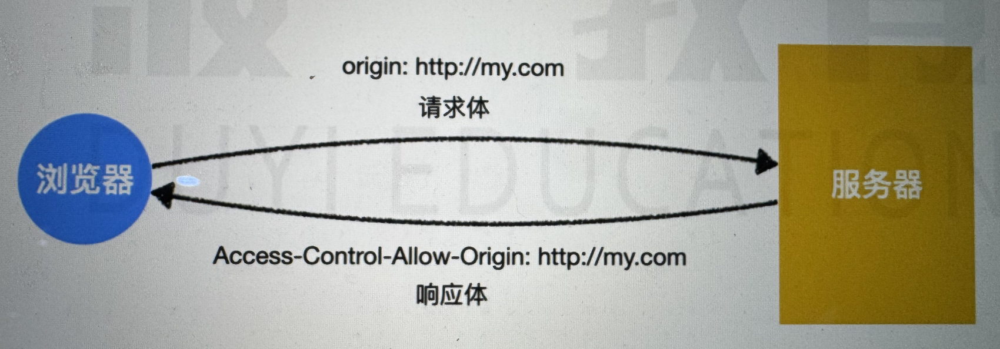

# 跨域 CORS

## JSONP 的问题

-   打乱服务器的消息格式

-   只能完成 GET 请求

## 概述

基于 http1.1 的跨域解决方案，全称是 Corss origin resource sharing 跨域资源共享。

思路：访问服务器的资源，需要获得服务器的许可。


一个请求可以携带很多的信息，对服务器造成不同程度的影响。

三种交互模式：

-   简单请求

-   预检请求

-   附带身份凭证请求

## 简单请求

1、同时满足以下条件的请求，称为简单请求：

-   get
-   post
-   head（仅仅是检查资源是否可用，但是不返回实际的数据）

2、请求头仅包含安全的字段：

-   accept
-   accept-language
-   content-language
-   content-type
-   dpr
-   downlink
-   save-data
-   viewport-width
-   width

3、如果包含 Content-Type 字段，那么其值只能是以下三种：

-   text/plain
-   multipart/form-data
-   application/x-www-form-urlencoded

三个条件全部满足，则认为是简单请求。

```js
// 简单请求
fetch("http://crossdomain.com/api/news");

// 请求方法不满足要求，不是简单请求
fetch("http://crossdomain.com/api/news", {
  method:"PUT"
})

// 加入了额外的请求头，不是简单请求
fetch("http://crossdomain.com/api/news", {
  headers:{
    a: 1
  }
})

// 简单请求
fetch("http://crossdomain.com/api/news", {
  method: "post"
})

// content-type不满足要求，不是简单请求
fetch("http://crossdomain.com/api/news", {
  method: "post",
  headers: {
    "content-type": "application/json"
  }
})
```

简单请求交互：

1、请求的时候浏览器会自动添加一个 Origin 字段。

2、服务器响应头包含 Access-Control-Allow-Origin 字段。

- * 表示允许所有的域

- 具体的值，例如 http://example.com



## 预检请求

只要不是简单请求，就会被视为预检请求。

1、浏览器不发送真实的请求，发送预检请求，询问服务器是否允许。

第一次请求方法为 OPTIONS，请求中不包括请求体，目的是为了询问服务器是否允许。

2、服务器允许

3、浏览器发起真是请求

4、服务器响应请求

## 附带身份凭证的请求

AJAX 不会携带 Cookie，某些操作无法操作。

```js
// xhr
var xhr = new XMLHttpRequest();
xhr.withCredentials = true;

// fetch api
fetch(url, {
  credentials: "include"
})
```

当携带 Cookie 后，无论是简单请求还是预检请求，都会携带 Cookie。

服务器需要明确响应 Access-Control-Allow-Credentials 字段，并且值为 true。

对于携带身份凭证的请求，服务器不能设置 Access-Control-Allow-Origin 为 *。