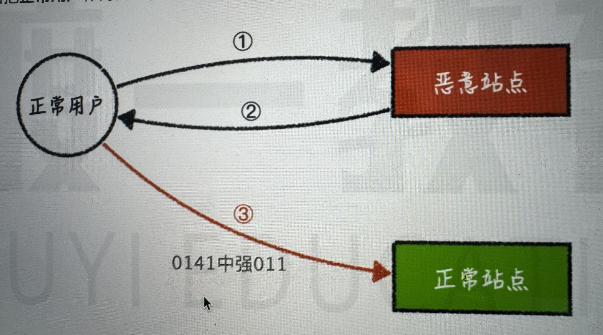
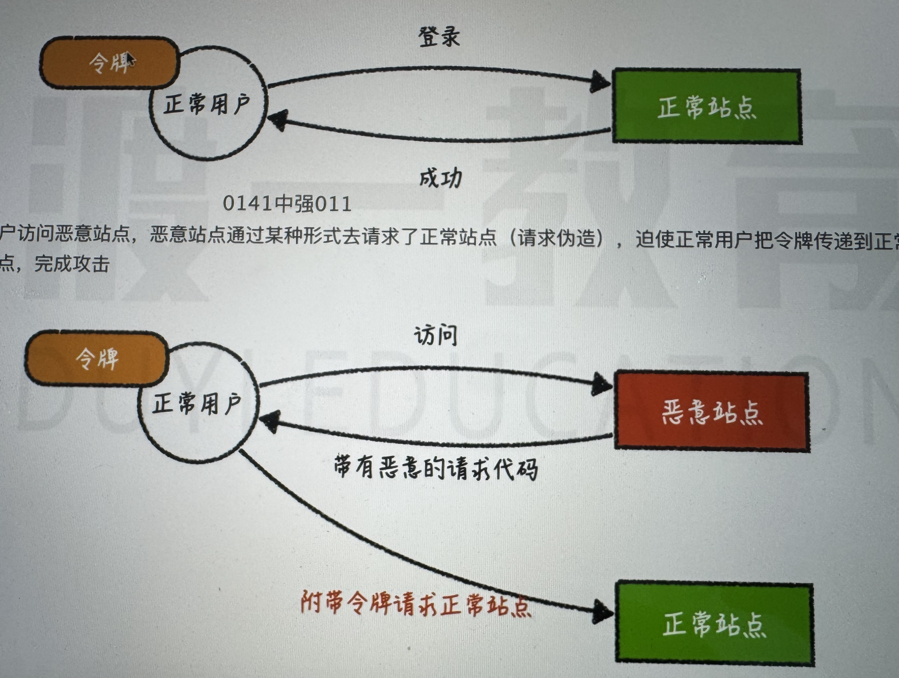

# CSRF 攻击

CSRF：跨站请求伪造（Cross-site request forgery），攻击者诱导受害者进入第三方网站，在第三方网站中，向被攻击网站发送跨站请求。利用受害者在被攻击网站已经获取的注册凭证，绕过后台的用户验证，达到冒充用户对被攻击的网站执行某项操作的目的。

原理如下：

1、用户访问正常放在，登录后拿到 token 凭证，以 cookie 的形式保存。

2、用户访问恶意网站，

## 防御

### cookie 的 SameSite 属性

cookie 只能在当前域名下使用，不能在其他域名下使用。

缺点：用户不能使用太老旧的浏览器。

### 验证 referer 和 origin

### 使用非 cookie 令牌

不校验 cookie，而是校验请求头 JWT。

### 验证码

### 表单随机数

基于服务端渲染。

### 二次验证