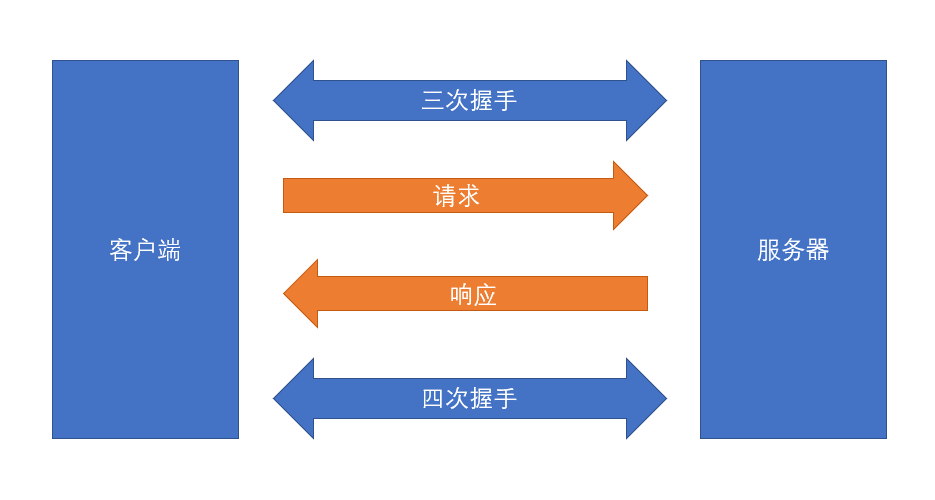
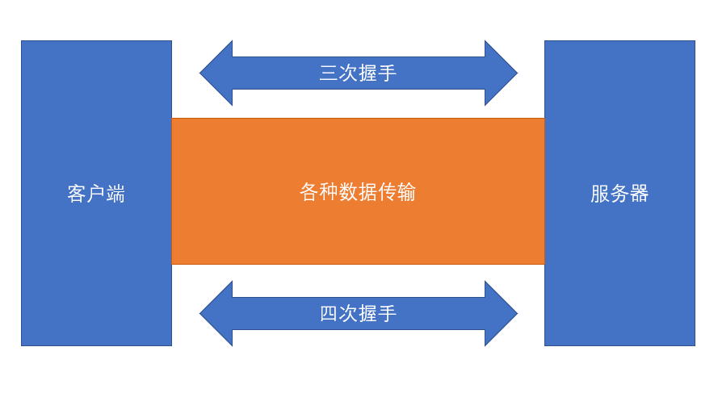
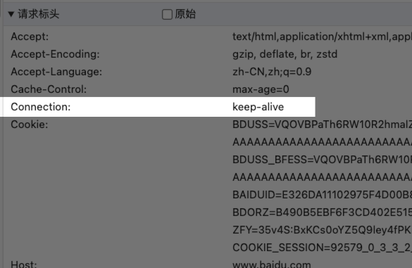
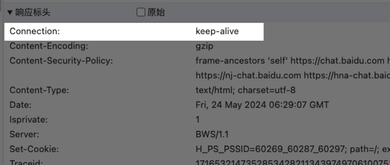
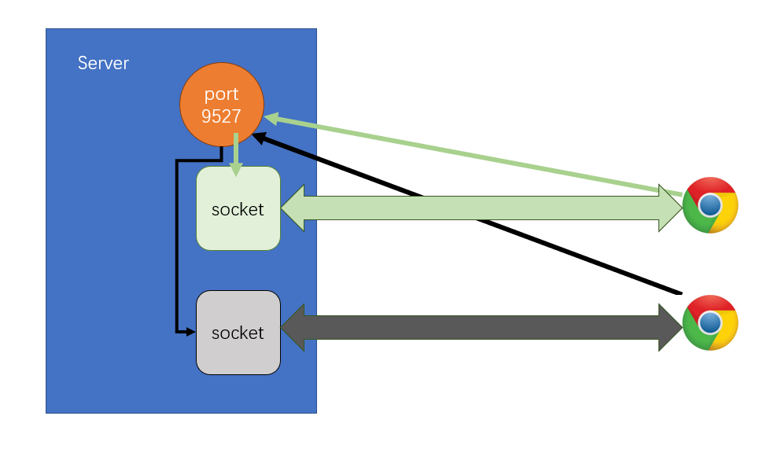

# net 模块

## 回顾 HTTP 请求

- 普通模式

    - 

- 长链接模式

    - 请求页面的时候会产生很多的请求（图片、js等），如果使用普通模式，会造成响应时间的降低，可以在一个非常短的时间内共用一个请求；

    - 

    - 

    - 

    - 表示告诉服务器不要那么着急的关掉服务，我可能还有别的请求，服务器同样的会返回一个 keep-alive 的标识

## net 模块能干什么？

就是一个通信模块，可以传输数据。

可以实现：

- 进程间的通信 IPC（了解）

- *网络通信 TCP/IP*（重点）

    - 比 HTTP 更加底层的协议

## 创建客户端

```js
const soket = net.createConnection(
    {
        host: 'www.baidu.com', // 链接到的主机
        port: 80
    },
    () => {
        console.log('链接成功'); 
    }
);
```

返回一个 soket！

- socket 是操作系统中一个特殊的文件，负责向网卡输送内容，往该文件内写入内容，就会通过链接把内容传递给远程主机，同样的远程主机返回内容，可以读取该文件得到内容；

- 在 node 表现为一个双工流；

详见 ./code/index.js

## 创建服务器

为什么会有两次链接呢？
因为又一次是测试链接。

```js
const net = require('node:net');
const server = net.createServer();

server.listen(9527);

server.on('listening', () => {
    console.log('server is listening on port 9527');
});

// 有客户端已经链接到服务器
server.on('connection', (socket) => {
    console.log('有客户端链接到服务器~');
    console.log(socket);
});
```

