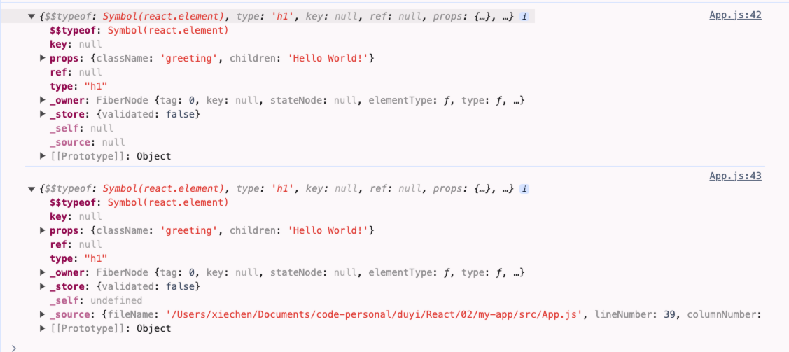

# 02 JSX 基础语法

## JSX 基础语法

在 React 中使用 JSX 语法来描述视图：

```jsx
function App() {
  return <div className='App'>Hello React!</div>;
}
```

只是长得像 HTML，但其实是 HTML 的语法。

JSX 的语法规则：

- 根元素只能有一个

```jsx
// 空标签
<>
  <ul>
    <li>1</li>
    <li>2</li>
    <li>3</li>
  </ul>
  <ul>
    <li>1</li>
    <li>2</li>
    <li>3</li>
  </ul>
</>
```

- JSX 使用 JavaScript 表达式，表达式写在 `{}` 中，不能书写语句

```jsx
function App() {
  const el = (
    <ul>
      <li>1</li>
      <li>2</li>
      {/* 正确 */}
      <li>{3 + 1}</li>
      {/* 错误 */}
      <li>{if(true){ 1 }}</li>
    </ul>
  );

  return el;
}
```

- 属性值书写为一个字符串，或者为 JS 表达式

```js
function App() {
  const el = (
    <ul>
      <li className='one'>1</li>
      <li className={true ? 'two' : 'three'}>2</li>
      <li>{3 + 1}</li>
    </ul>
  );

  return el;
}
```

需要注意的是，在 JSX 中，class 属性需要写成 className，style 属性需要写成对象，for 属性需要写成 htmlFor。

```jsx
function App() {
  const el = (
    <>
      <ul
        style={{
          color: 'red',
          fontSize: '16px'
        }}>
        <li>1</li>
      </ul>
    </>
  );

  return el;
}
```

- 注释需要卸载 `{}` 中去

```jsx
function App() {
  // 这是注释
  const el = (
    <>
      <ul
        style={{
          color: 'red',
          fontSize: '16px'
        }}>
        {/* 这是注释 */}
        <li>1</li>
      </ul>
    </>
  );

  return el;
}
```

- 数组标签自动展开，以及列表循环

```jsx
function App() {
  const personList = [
    { name: '张三', age: 18 },
    { name: '李四', age: 20 }
  ];

  const arr = [<p key='1'>Hello</p>, <p key='2'>world</p>, <p key='3'>hhh</p>];
  let arr2 = [];

  arr2 = personList.map((el, index) => {
    return (
      <div key={index}>
        {el.name}---{el.age}
      </div>
    );
  });

  const el = (
    <>
      <ul
        style={{
          color: 'red',
          fontSize: '16px'
        }}>
        <li>1</li>
      </ul>
      {arr}
      {arr2}
    </>
  );

  return el;
}
```

## createElement() 方法

JSX 是 JS 的语法拓展，Babel 会对 JSX 代码进行编译为 React.createElement() 函数的调用，返回一个 JS 对象。

```js
React.createElement(type, [props], [...children]);
```

- type，元素类型

- props，元素属性

- children，子元素

```jsx
const el3 = <h1 className='greeting'>Hello World!</h1>;
// el 等价于 el2
const el2 = React.createElement('h1', { className: 'greeting' }, 'Hello World!');
console.log(el2);
console.log(el3);
```



jsx 的语法更贴合 HTML 的语法，JSX 本质上就是 React.createElement() 方法的语法糖，相比 React.createElement() 书写起来会非常的简单。