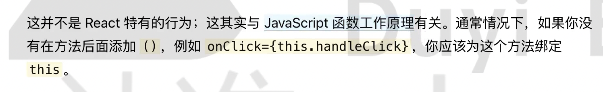
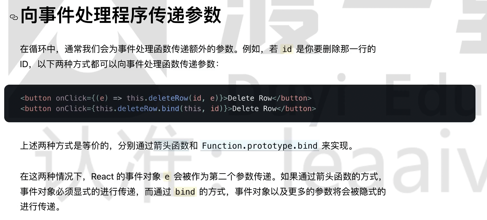

# 组件和事件绑定

## React 中的组件

React 的组件可以是类组件或者函数式组件。早期的函数式组件是 5️ 无状态的，仅用于展示视图。

详见 App.js

## 为组件绑定事件

```jsx
function onClick(event) {
  // event 不是原始的事件对象，是一个合成事件
  console.log(event);
  // 获取原生的事件对象
  console.log(event.nativeEvent);
}

function onClickLink(event) {
  event.preventDefault();
}

const el = (
  <>
    <butto onClick={onClick}>Click</butto>
  </>
);
```

不能使用返回 false 阻止默认的事件，需要使用 event.perventDefault()。

## this 的指向

主要指类组件。

```jsx
 onClickBtn(){
    console.log(this); // undefined
    console.log('Click');
  }

  render() {
    return (
      <>
        <button onClick={this.onClickBtn}>Click</button>
      </>
    );
  }
```

this 指向当前实例。

为什么是 undefined？



解决：

1、剪头函数

2、使用 bind

```jsx
render() {
    return (
      <>
        <button onClick={this.onClickBtn.bind(this)}>Click</button>
      </>
    );
  }
```

## 传递参数



```jsx
function App() {
  function onClick(prop) {
    console.log(prop);
  }

  const el = (
    <>
      <button onClick={() => onClick('prop')}>Click</button>
    </>
  );

  return el;
}
```
