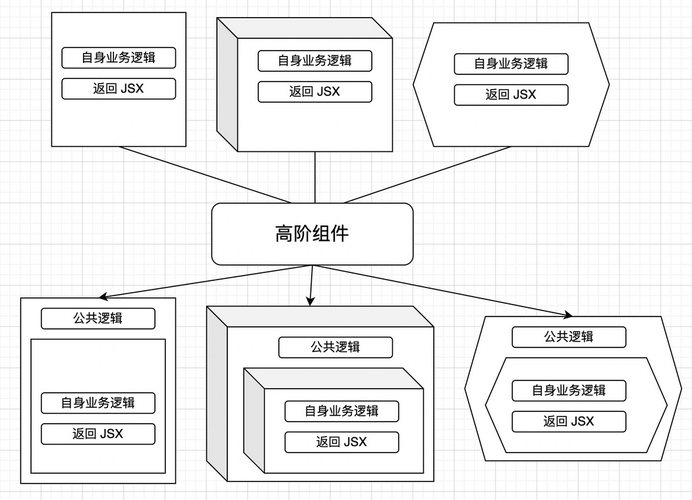

# 高阶组件

简称 HOC，是 React 中用于复用组件逻辑的一种高级技巧。

注意点：

- 高阶组件并非一个组件，而是增强组件功能的一个函数；

- 作用是对多组件公共逻辑进行横向的抽离；

## 高阶组件是一个函数

稍微具有一点欺骗性，不是组件，而是一个函数。

官方解释：参数为组件，返回值为新组件的函数。

## 高阶组件的事情

## 高阶组件的现状

解决了组件之间横向抽离公共逻辑的问题。

HOC 实际上是为了解决早期类组件的公共逻辑的问题，现在 React 的开发思想从面向对象转为了函数式编程，公共逻辑使用自定义的 Hook 来解决。