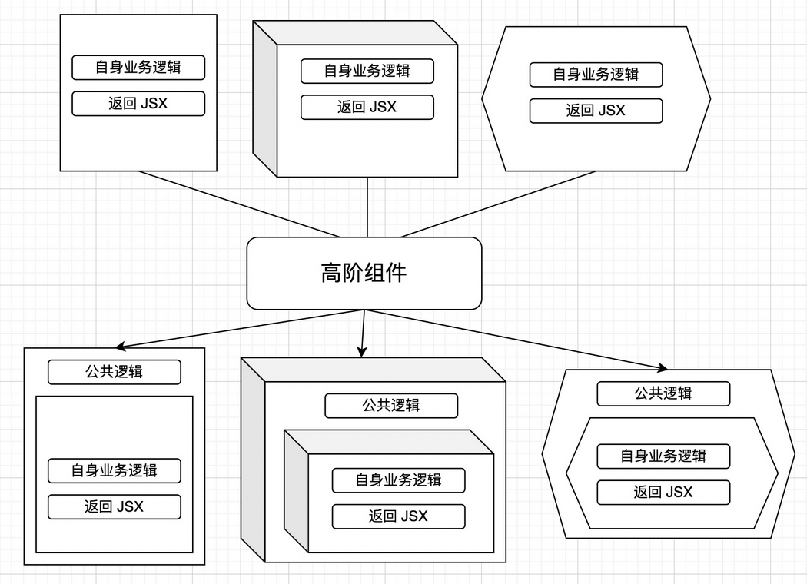

# 高阶组件

简称 HOC，是 React 中用于复用组件逻辑的一种高级技巧。

注意点：

- 高阶组件并非一个组件，而是增强组件功能的一个函数；

- 作用是对多组件公共逻辑进行横向的抽离；

## 高阶组件是一个函数

稍微具有一点欺骗性，不是组件，而是一个函数。

官方解释：参数为组件，返回值为新组件的函数。

## 高阶组件的事情

高阶组件作为一个函数，接收你传入的组件，然后又返回一个新的组件，在内部对原有组件做了一些增强操作。

早期采用 mixin 来解决，不过现在已经不推荐使用了。

[示例： 日志打印的组件]

[示例： 计时器的组件]

高阶组件一般都是以 with 开头，社区习惯。

## 高阶组件的现状

解决了组件之间横向抽离公共逻辑的问题。

HOC 实际上是为了解决早期类组件的公共逻辑的问题，现在 React 的开发思想从面向对象转为了函数式编程，公共逻辑使用自定义的 Hook 来解决。