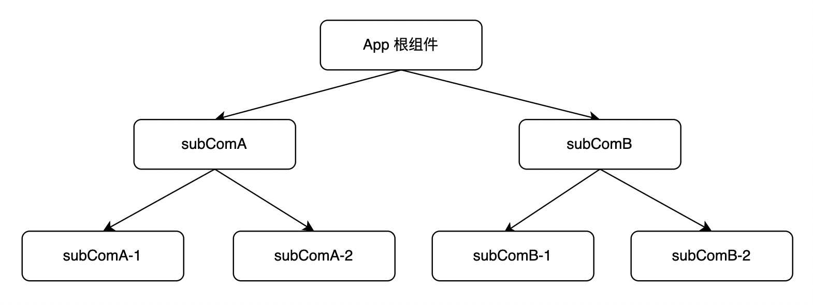

# Context

重点内容。

## 要解决的问题

组件之间状态共享的问题。



上下文就是数据环境信息，需要什么直接从环境中读取就可以了。

## Context 的使用

三个步骤：

1、创建

2、提供

3、消费

- 函数组件的使用方式

- 类组件的使用方式

## 默认值

const MyContext = createContext("hello world");

不提供 provider 就会使用默认值，子组件直接消费默认的数据。

## 多个上下文环境

```
<ThemeContext.Provider value='dark'>
  <MyContext.Provider value='hello context'>
    <ChildCom />
  </MyContext.Provider>
</ThemeContext.Provider>
```

如果存在同名的 context，会使用最近的 provider 提供的数据。

## 相关的 hook

useContext

- 消费上下文环境中的数据