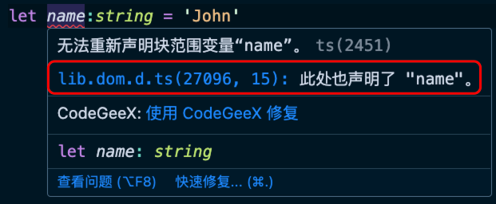

# 安装和运行

安装

```bash
$ npm install --save-dev typescript
```

命令

```bash
$ npx tsc

$ npx tsc --version # 查看版本

$ npx tsc --init # 初始化配置文件 tsconfig.json
```

运行 TS 文件的一些问题：

1、全局变量问题

TS 默认情况下会做出以下的假设：

- 当前环境为 DOM 环境，例如 window.name。



- 如果代码中没有模块化语句，默认代码是全局执行的，所以变量都是全局变量。


使用 TS 的配置文件或者命令行参数

```ts
// 使用模块化
export {};
```

2、默认编译的目标代码是 ES3

```js
var str = 'Hello World';
console.log(str);
```

3、TS 配置文件

Link: https://www.typescriptlang.org/tsconfig/

```json
{
  // 指定要编译的文件与目录
  "include": ["src/**/*.ts"],
  // 排除的文件与目录
  "exclude": ["node_modules", "dist"],
  "compilerOptions": {
    // 输出目录
    "outDir": "./dist",
    // 编译目标版本
    "target": "ES2015",
    // 指定 TS 可以使用的内置库（如何不设置，默认和 target 一致）
    "lib": ["ESNext", "DOM"]
  }
}
```

如果工程目录下存在 tsconfig.json 文件，则使用该文件中的配置，否则使用命令行参数。

4、简化运行 TS 项目

- [ts-node](https://www.npmjs.com/package/ts-node)

- [nodemon](https://www.npmjs.com/package/nodemon)

- npx tcs -w