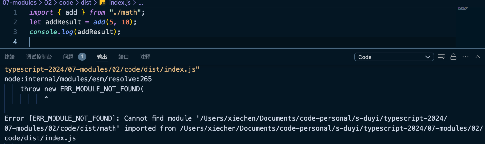

# 模块解析策略

预设现在是一个纯粹的环境中（非 Webpack）。

ESM 和 CMS 如何解析模块的？

- 文件模块

- 目录模块

- 内置模块

- node_modules 模块

无法解析这么模块是因为没有后缀名。

CMS 是可以自动进行补全后缀名的。

ESM 则不可以，主要是服务浏览器的。

浏览器环境下必须要求路径是一个绝对的路径。或者一个可访问的 URL 地址。

浏览器环境中可以配置一个 import map 设置。