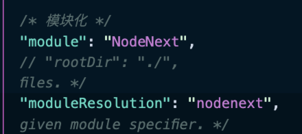
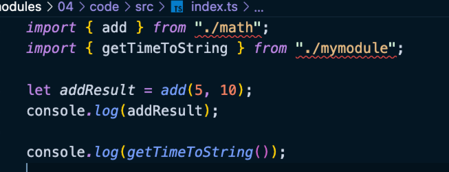

# 模块化实践

预设 modele 只有两个值，一个是 `commonjs`，一个是 `esm`，默认值是 `commonjs`。

- module

    - nodeNext: 如果项目中既存在 `commonjs` 的模块，又存在 `esm` 的模块，那么需要配置。moduleResolution: node 即可。

因为 nodenext 同时支持 cms 和 esm，所以必须添加后缀名，否则不知道加载哪个文件。后缀名不能是 .ts，因为 TS 编译后不会对路径重写。

如果是纯粹的环境内，需要我们自己负责模块的解析策略。

- "module": "CommonJS" +  "moduleResolution": "node" 文件名不需要加后缀

- "module": "ES2015" + "moduleResolution": "node" 纯粹的环境是无法执行的，需要借助打包工具

- "module": "ES2015" + "moduleResolution": "NodeNext" 是需要加后缀名的

- 某些模块需要配置 "moduleResolution": "bundler"，意思是让打包工具来自己去解析