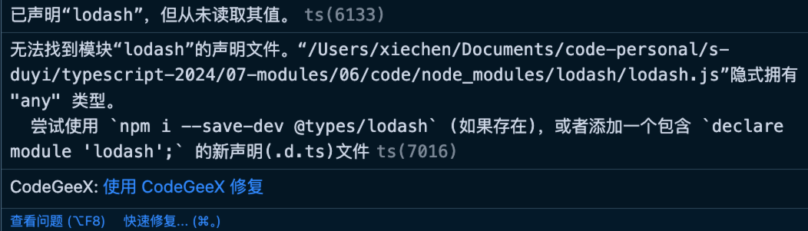

# 类型声明和模块化

什么是类型声明？

用途？

- 自己写一个包，基于 TS 的类型支持，不能直接把 TS 的源代码交给用户，需要编译成 JS，同时需要 TS 的类型提示；

- 我们下载了别人的包，包只是基于 JS 的没有 TS，需要到相关的社区找到类型声明文件。如果没有则需要自己写；

- 开发项目的时候需要补充一些全局的类型声明，需要手动的加上类型声明文件；

配置：

- "declaration": true // 生成类型声明文件

- "declarationDir": "./dist/types" // 指定类型声明文件输出目录

如果配置了 module 需要导出内容，否则类型声明文件是空的。

## 自己编写声明文件

declare 用于描述下面的类型：

- 变量
- 函数
- 类
- 枚举
- 命名空间
- 接口

> 可以把 declare 理解为一个标志，后面声明的是一个类型。在 TS 可以直接使用，不会报错。

可以把 type.d.ts 想想成为 node_modules/package 中的文件，具体的实现是包内实现的。

如果 type.d.ts 内部没有模块化的关键字则认为这个文件是全局的，不需要进行导入就可以使用。

另外还可 tsconfig.json 中配置 "includes" 有关系。

自己写这个类型声明文件没有太大的意义。

安装一些 lodash，这个包默认是没有类型声明文件的。

```ts
import lodash from "lodash";
// ❌ 无法找到模块“lodash”的声明文件。
```



TS g诶我们提出了建议。