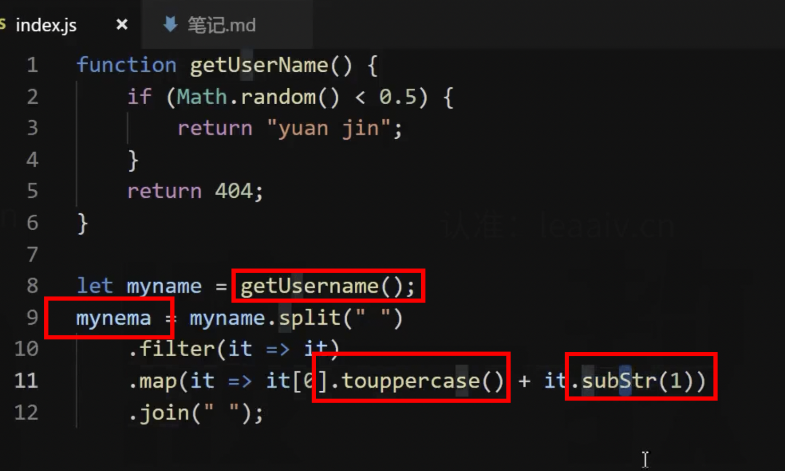
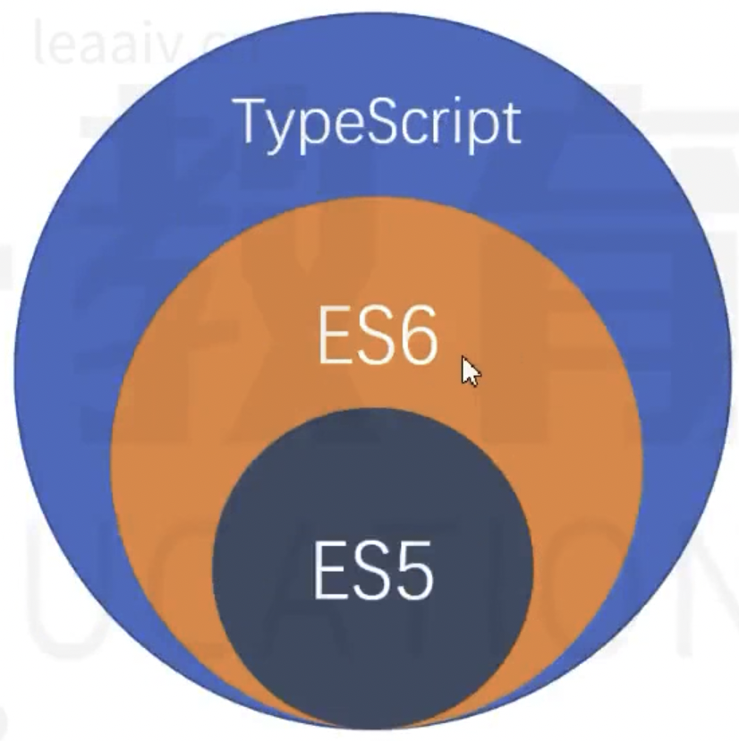
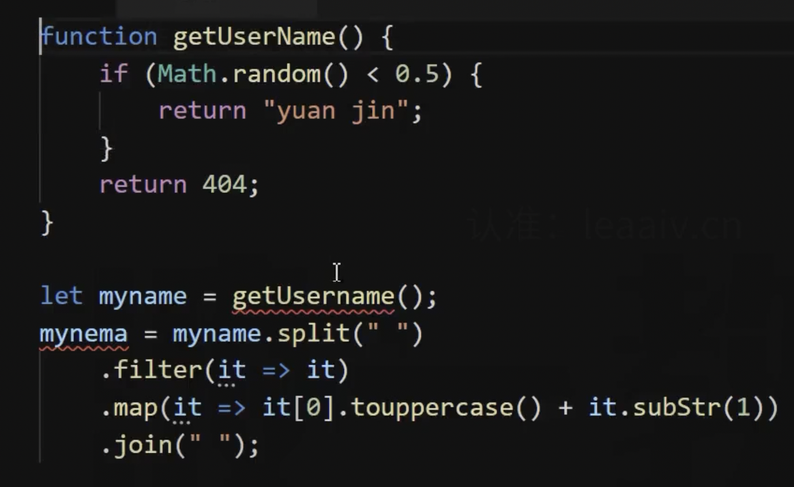

# 1 概述

## 为什么需要 TS？

- 更好的开发体验

- 解决 JS 中一些难以处理的问题

## JS 语言的问题



代码的错误：

- 使用了不存在的变量或者成员

- 如果返回 404 ，那么后续的方法就无法执行产生错误（把不确定的类型当做确定的类型进行处理）

- 代码中没展示，在使用 null 或者 undefined 成员，以为是个正常的对象，结果调用了属性

```js
const obj = undefined;
console.log(obj.name);
```

JS 的原罪：

- JS 语言本身的特性，决定了该语言无法适应大型的复杂的项目，设计的时候就不是为了大项项目准备的是，只是为了实现一些简单的效果

- 若类型语言（某个变量可以随时的更改数据类型）


- 解释性语言，看一段代码执行一段，导致代码必须运行后才知道错误，而不是在编写的时候就发现了错误

前端开发中大部分的时候都是在排查错误，这个时候 TS 出来了。

## TypeScript 语言的特点

TypeScript 是 JS 的一个的超集，是一个可选的静态类型系统。

- 超集：TS 是包括 JS 语言的所有功能的，语言还是 JS 语言，新增了一些内容，新增的是一个类型的系统



- 类型系统：就是对代码中所有的标志符（变量、函数、参数、返回值）进行类型检查（例如数据类型是 number 那么就不能赋值 string 类型）

- 可选的：类型系统可用可不用，不强制要求，如果使用了那就会进行类型检查



- 静态的：TS 会进行类型检查，在编译阶段就会进行类型检查，不会在运行时进行类型检查

无论是浏览器环境还是 Node 环境，都无法直接使用 TS 代码，和把 ES6 代码转换为 ES5 代码一样，TS 也需要一个编译器把 TS 代码转换为 JS 代码，这个编译器就是 tsc。

tsc：把 TS 代码转换为 JS 代码，然后 JS 代码就可以直接运行了，TS 不参与直接的运行。

## TS 的常识

- 微软公司在 2012 年发布

- 开源、拥抱 ES 标准的

- 目前版本是 5

https://www.typescriptlang.org/zh/

## 额外的惊喜

TS 的定位就是一个类型检查系统，使用类型检查就是为了检查 JS 发现不了的错误，但是我们会发现一些额外的惊喜。

有了类型检查，增强了面向对象的开发，JS 中也有类和对象，JS 支持面向对象开发，由于缺少类型检查存在很多的问题。

使用了 TS 后，可以编写出完善的面向对象代码。