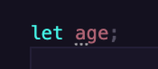

# 3 基本类型检查

TS 是一个可选的静态类型系统。

## 如何进行类型约束

可以约束变量、函数的参数、函数的返回值。

只需要在的位置上加上`:类型`

```ts
let name: string;
name = "Joe";
name = 123; // ❌不能将类型“number”分配给类型“string”
```

```ts
function sum(a: number, b: number): number {
  return a + b;
}
sum(1, "abc"); // ❌类型“string”的参数不能赋给类型“number”的参数
```

```ts
function sum(a: number, b: number): number {
  return a + b;
}
let num: string = sum(1, 123); // ❌不能将类型“number”分配给类型“string”
```

TS 在很多的场景中可以完成类型推导：

```ts
// 推导为：function sum(a: number, b: number): number
function sum(a: number, b: number) {
  return a + b;
}
```

```ts
// 推导为：let name: string
let name = "Joe";
```

小技巧：如何知道什么时候可以推导什么时候不能推导呢？



如果没有推导出来，那么变量的下面会出现 3 个小点，会推断为 any 类型，any 类型表示任意类型，TS 不会对该类型进行类型检查。

## 源代码和编译结果的差异

编译结果内部是没有任何 TS 代码的，TS 代码运行监测时静态的，在编译的时候就会报错

## 基本类型

在 JS 代码中支持的类型：

- number

- string

- boolean

- 数组，必须约束到数组的每一项是什么类型

```js
// 数字类型的数组（推荐）
let nums: number[] = [1, 2, 3];
// 语法糖
let nums2: Array<number> = [3, 4, 5];

// 推断为：let strs: string[]
let strs = ["a", "b", "c"];
```

- object，不常见，不精准，因为无法约束到对象内部的属性

```ts
let u: object;
u = {};

function printValues(obj: object) {
  let values = Object.values(obj);
  values.forEach((el) => console.log(el));
}
```

- null 和 undefined

都表示空数据，是所有其他类型的子类型，它们可以赋值给其他类型

```ts
let n: string = null;
let s: number = undefined;

n.toLocaleUpperCase(); // 错误
```

这个时候我们更改配置文件，让 TS 对空数据进行更加严格的检查。

```json
 "strictNullChecks": true // 开启严格的空类型检查
```

## 其他类型

- 联合类型

就是将多种类型任选其一，配合类型保护进行判断。

类型保护：当对某个变量进行类型判断之后，在判断的语句块（if）中便可以确定它的确切类型。typeof 可以触发基本类型包括。

```js
let name: string | number = "Joe";
name = 123; // name 可以是多种类型
```

- void 类型

在 JS 中表示运算一个表达式后返回一个 undefined，在 TS 中通常用于约束函数的返回值，表示该函数没有返回值。

```ts
function printMenu(): void {
  console.log("1.登录");
  console.log("2.注册");
}
```

- never 类型

通常用于约束函数的返回值，表示该函数永远不可能结束

```js
function throwError(msg: string): never {
  throw new Error(msg);
  console.log("abc"); // 检测到无法访问的代码
}

function alwaysDoSomething(msg: string): never {
  // 死循环
  while (true) {
    // ...
  }
}
```

- 字面量类型

使用一个值进行约束，只能选择某个值。

```js
let str: "A" | "B" | "C";
str = "D"; // ❌不能将类型“"D"”分配给类型“"A" | "B" | "C"”

let num: 10 | 20 | 30;
num = 30;

// arr 永远只能取值为一个空数组
let arr: [];
arr = [1, 2];

// 表示对象必须要有 name 和 age 属性且类型要是 string、number
let user: {
  name: string,
  age: number
};

user = {
  name: "xiechen",
  age: 34
};
```

- 元祖类型（Tuple）

表示一个固定长度的数组，并且数组中的每一项类型确定

```js
// 数组必须是两项，必须是字符串、数字类型
let tu: [string, number] = ["a", 1];
tu = ["b", 2];
tu = []; // ❌不能将类型“[]”分配给类型“[string, number]”
```

- any 类型

any 类型可以绕过类型检查，因此 any 类型数据可以赋值给任意的类型。不能随意的使用 any 类型

```js
let data: any = "abc";
let num: number = data;
```

这就是 TS 在 JS 的基本类型上拓展的其他类型，统称为 TS 的基本类型。

## 类型别名

对已知的一些类型定义名称

```ts
let u: { name: string; age: number; gender: "男" | "女" };

// 返回一个和 u 同样结构的数组对象
function getUsers(): { name: string; age: number; gender: "男" | "女" }[] {
  return [];
}
```

如果 u 的结构更改，那就需要到处更改，因为最好的办法就是把 u 的类型单独提取出来，去一个名字然后共用

```ts
type TypeName {}
```

```ts
type TypeUser = { name: string; age: number; gender: "男" | "女" };

let u: TypeUser = {
  name: "xiechen",
  age: 34,
  gender: "男"
};

function getUsers(): TypeUser[] {
  return [];
}
```

类型别名可以进行组合：

```ts
type TypeGender = "男" | "女";
type TypeUser = { name: string; age: number; gender: TypeGender };

let u: TypeUser = {
  name: "xiechen",
  age: 34,
  gender: "男"
};

function getUsers(gender: TypeGender): TypeUser[] {
  return [];
}
```

## 函数的相关约束

```ts
// 最好的做法是要么全部都是字符串，要么全部都是数字，要定下来一个准确的类型
function combine(a: number | string, b: number | string): number | string {
  if (typeof a === "number" && typeof b === "number") {
    return a * b;
  } else if (typeof a === "string" && typeof b === "string") {
    return a.toString() + b.toString();
  }
  throw new Error("a和b必须是相同的类型");
}
const result = combine(1, "b");
```

```ts
/* 
  告诉 TS 这个函数只能有两种情况
  都是 string 类型
  都是 number 类型
*/
function combine(a: number, b: number): number;
function combine(a: string, b: string): string;

function combine(a: number | string, b: number | string): number | string {
  if (typeof a === "number" && typeof b === "number") {
    return a * b;
  } else if (typeof a === "string" && typeof b === "string") {
    return a.toString() + b.toString();
  }
  throw new Error("a和b必须是相同的类型");
}
combine(1, 2);
combine("a", "b");
combine(1, "b"); // ❌没有与此调用匹配的重载
```

函数重载：在函数实现之前，对函数调用的多种情况进行声明

可选参数：可以在某些参数名后面加上？表示该参数可以不用传递

```ts
function sum(a: number, b: number, c?: number): number {
  if (c) {
    return a + b + c;
  }
  return a + b;
}
sum(1, 2, 3);
sum(1, 2);
```

可选参数不能是第一个参数，只是在参数列表的末尾

默认参数：

c 会自动推断为可选参数

```ts
// function sum(a: number, b: number, c?: number): number
function sum(a: number, b: number, c: number = 0): number {
  return a + b + c;
}
sum(1, 2, 3);
sum(1, 2);
```