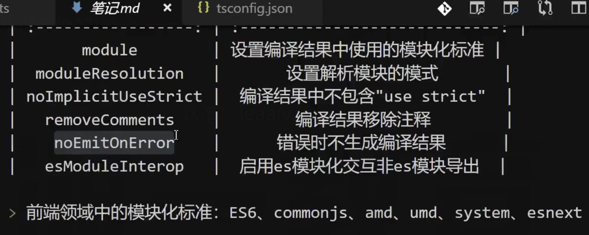

# 5 模块化

目前前端领域中的模块化标准：

ESModule、CommonJS、AMD、UMD、CMD

- TS 如何书写模块化语句？

- 编译的结果是什么样？

## 在 TS 中如何书写模块化

TS 中导入和导出模块统一使用 ES6 的模块化标准。

```ts
// index.ts

// 不需要加 .ts 拓展名
import { name, sum } from "./a";

console.log(sum(1, 2));
```

```ts
// a.ts
export const name = "index.ts file";
export function sum(a: number, b: number) {
  return a + b;
}
```

## 编译结果中的模块化

配置文件可以配置编译结果要编译为什么模块化标准。

tsconfig.ts => compilerOptions.module = "commonjs | ES6"

- 如果 tsconfig.json 配置的模块化为 ES6，且 TS 文件书写的也是 ESModule 的标准，那么编译结果就是 ESModule 标准，没有区别。

```js
// a.js
export const name = "index.ts file";
export function sum(a: number, b: number) {
  return a + b;
}
```

- 如果 tsconfig.json 配置的模块化为 CommonJS，且 TS 文件书写的也是 ESModule 的标准，那么编译结果就是 Common 标准

```js
// a.js
Object.defineProperty(exports, "__esModule", { value: true });
exports.sum = exports.name = void 0;
exports.name = "index.ts file";
function sum(a, b) {
  return a + b;
}
exports.sum = sum;
```

TS 中的模块化在编译结果中：

- 如果编译结果中的模块化标准是 ESModule，代码不会做任何改动。

- 如果编译结果中的模块化标准是 CommonJS，导出的声明会变成 exports 的属性，默认的导出会变成 exports.default 属性。

到目前为止的配置文件：

删除了 @types/node 库

```ts
{
  // 配置编译选项
  "compilerOptions": {
    // 编译为 JS 代码的标准
    "target": "ES2016",
    // 配置编译目标使用的模块化标准
    "module": "CommonJS",
    // 表示 TS 要使用哪些库，使用哪些全局的环境
    "lib": [
      "ES2017",
      "DOM"
    ],
    // 配置编译结果的保存目录
    "outDir": "./dist",
    // 确保每个文件都是个单独的模块
    "moduleDetection": "force",
    // 开启严格的空类型检查
    "strictNullChecks": true,
    // 编译结果删除 TS 中的注释
    "removeComments": true,
    // 编译结果取消严格模式（没成功）
    // "noImplicitUseStrict": true
  },
  // 编译文件夹下面的代码
  "include": [
    "./src"
  ]
  // 编译指定目录下的 ts 文件
  // files: ["./src/index.ts"] // 只编译指定的文件
}
```

## 解决默认导入的错误

安装 @types/node

```ts
import fs from "fs"; // ❌模块“"fs"”没有默认导出
fs.readFileSync("./");
console.log(fs);
```

编译结果：

```js
Object.defineProperty(exports, "__esModule", { value: true });
const fs_1 = require("fs");
fs_1.default.readFileSync("./");
console.log(fs_1.default);
```

使用 .default 来获取 readFileSync 方法。

为什么？

因为 fs 根本就不是使用 TS 写的

fs 的导出是这样的： module.exports = {}

如何处理？

```ts
import { readFileSync } from "fs";
readFileSync("./");
```

因为 TS 都是使用 ESModule 模块化，而 fs 使用的却是 CommonJS，自然没有 .default 属性，我们可以通过结构的方式进行导入

或者

```ts
import * as fs from "fs";
```

总结：

通过 module.export 导出的无法使用默认导入！

如果非要使用这样的方式，需要新增一个配置

```json
"esModuleInterop": true, // 启用ES模块化交互非ES模块导出
```

编译结果：

```js
var __importDefault =
  (this && this.__importDefault) ||
  function (mod) {
    return mod && mod.__esModule ? mod : { default: mod };
  };
Object.defineProperty(exports, "__esModule", { value: true });
const fs_1 = __importDefault(require("fs"));
fs_1.default.readFileSync("./");
```



## 如何在 TS 中使用 commonjs 规范

```ts
module.exports = {
  name: "xiechen"
};
// const moduleName: any
const moduleName = require("./a.js");
```

虽然书写 TS 的代码完全没有问题，但是这样的写法无法获得类型的检查

怎么办？必须安装 TS 的要求进行书写，最好还是使用 ESModule

```ts
module.exports = {
  name: "xiechen"
};
const moduleName = require("./a.js");

// ==>

export = {
  name: "xiechen"
};
import moduleName = require("./a.js");
```

还是建议使用 ESModule

## 模块解析

在 TS 中有两种模块解析策略

模块解析：应该从什么位置寻找模块

- classic: 经典（在 ESModule 之前，使用 TS 自己的模块解析策略）

- node：使用 node 解析策略（唯一的变化是将 JS 体会为 ts）

  - 相对路径 require("./xxx") 先找当前目录

  - 非相对模块 require("xxx") ,找的是 node_modules 下的目录