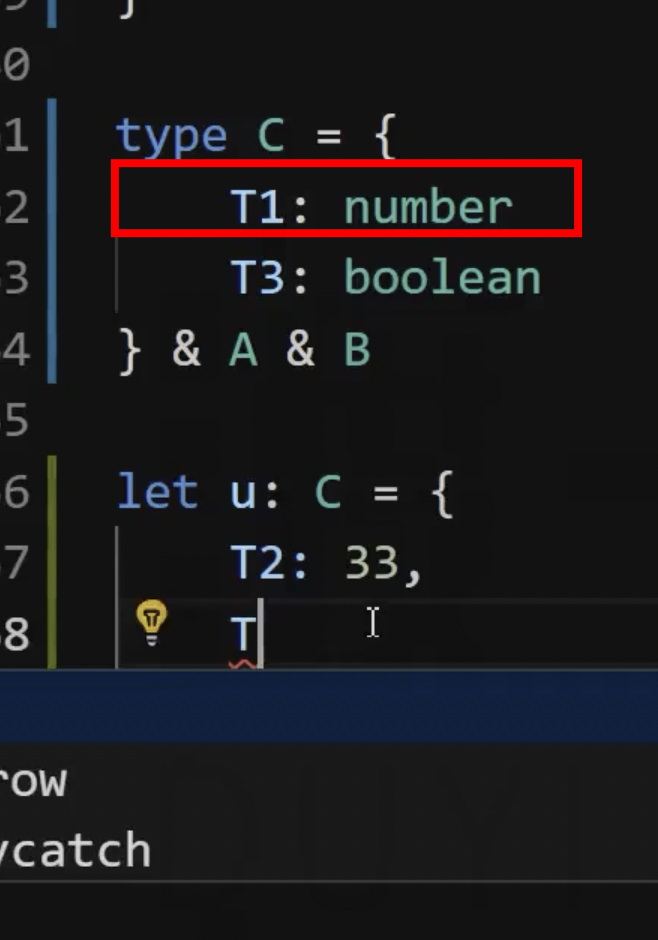

# 6 接口和类型兼容性

## 接口的概念

> 拓展类型：类型别名、枚举、接口、类

interface

接口的作用：

1、计算机领域

2、现实生活中，USB 接口、电源接口

3、开发中，某些技术文档中的接口文件、请求 API 接口

TS 中接口的含义：

用于「约束」类、对象、函数的契约（看作是一个标准）

例如电源接口肯定是要满足某一种标准做出来的，技术文档中提供的一些接口也是一种标准。

有了标准之后大家都去按照标准去开发就不会出现问题。

标准的形式：

- API 文档是一个弱标准，因为可能不遵守或者写错

- 代码约束，强标准，如果写的不对编辑器立马就会进行提示

## 接口的使用

### 接口约束对象

```ts
interface IUser {
  name: string;
  age: number;
}

let u: IUser = {
  name: "xiechen",
  age: 23
};
```

和类型别名的区别？
接口和类型别名在现阶段区别不大，是有区别的？最大的区别是在约束类的时候。

接口和类型别名一样，接口不出现在编译结果中。

### 接口约束函数

对象内的函数:

```ts
/* interface IUser {
  name: string;
  age: number;
  sayHello: () => void;
} */

interface IUser {
  name: string;
  age: number;
  sayHello(): void;
}
let u: IUser = {
  name: "xiechen",
  age: 23,
  sayHello() {
    console.log("hello");
  }
};
```

直接约束一个函数：

```ts
type TCondition = (n: number) => boolean;

function sum(numbers: number[], callback: TCondition) {
  let s = 0;

  numbers.forEach((n) => {
    if (callback(n)) {
      s += 0;
    }
  });

  return s;
}

const result = sum([3, 4, 5, 6, 7], (n) => n % 2 === 0);
console.log(result);
```

```ts
interface ICondition {
  (n: number): boolean;
}

function sum(numbers: number[], callback: ICondition) {
  let s = 0;

  numbers.forEach((n) => {
    if (callback(n)) {
      s += n;
    }
  });

  return s;
}

const result = sum([3, 4, 5, 6, 7], (n) => n % 2 === 0);
console.log(result);
```

类型别名也可以写成 interface 的方式：

```ts
// type TCondition = (n: number) => boolean;

type TCondition = {
  // 定界符，表示具体的类型而不是对象
  (n: number): boolean;
};
```

### 接口可以继承

react 中的继承：

```js
class My extends React.Component {}
```

子类可以拥有父类所有的成员、资源，这就继承。

接口的继承：

```ts
interface A {
  T1: string;
}

interface B extends A {
  T2: number;
}

let c: B = {
  T1: "1",
  T2: 1
};
```

多继承：

```ts
interface A {
  T1: string;
}

interface B {
  T2: number;
}

interface C extends A, B {
  T3: boolean;
}

let test: C = {
  T1: "1",
  T2: 1,
  T3: true
};
```

可以通过接口之间的继承实现多个接口的组合。

类型别名也可以进行组合。

```ts
type A = {
  T1: string;
};

type B = {
  T2: number;
};

type C = A &
  B & {
    T3: boolean;
  };

let test: C = {
  T1: "1",
  T2: 1,
  T3: true
};
```

使用类型别名可以实现类似的效果，需要通过 & 进行，它叫做交叉类型。

区别：

在接口的继承中，子接口不能重新覆盖父接口内的成员。

在类型别名中的交叉类型中，会把相同成员的类型进行交叉。



这个时候 T1 就变成 number & string 类型，无法进行赋值了。

## readonly

这是 TS 中的一个修饰符，修饰符可以修饰一些类型、一些类的属性。

只读修饰符，修饰的目标是只读的，不能更改。

```ts
interface User {
  id: string;
  name: string;
  age: number;
}

let u: User = {
  id: "123",
  name: "xiechen",
  age: 1
};
u.id = "456"; // 不合理的操作
```

```ts
interface User {
  readonly id: string;
  name: string;
  age: number;
}

let u: User = {
  id: "123",
  name: "xiechen",
  age: 1
};
u.id = "456"; // ❌无法为“id”赋值，因为它是只读属性
```

只读修饰符不在编译结果中。

类型别名也是一样的：

```ts
type User = {
  readonly id: string;
  name: string;
  age: number;
};
```

约束数组：

```ts
let arr: readonly number[] = [1, 2, 3];
arr = [4, 5, 6];
```

readonly 约束的不是 arr 变量，如果你希望变量不被重新赋值使用 const 赋值即可。

readonly 表示该数组是一个只读的数组，这个时候凡是涉及到对该数组进行改动的相关方法都无法调用了。

```ts
let arr: readonly number[] = [1, 2, 3];
arr = [4, 5, 6];
arr[0] = 4; // ❌类型“readonly number[]”中的索引签名仅允许读取
arr.push("1"); // ❌类型“readonly number[]”上不存在属性“push”
console.log(arr);
```

如果是类型别名中的数组，使用 readonly 可以约束数组不能被更改

```ts
type User = {
  readonly id: string;
  name: string;
  age: number;
  readonly arr: number[];
};

let u: User = {
  id: "123",
  name: "xiechen",
  age: 1,
  arr: [1, 2, 3]
};
u.arr.push(4); // 可以调用 push 方法
u.arr = [4, 5, 6]; // ❌无法为“arr”赋值，因为它是只读属性
```

如果既希望对象的数组不能重新赋值也不能调用方法如何做呢？

```ts
type User = {
  readonly id: string;
  name: string;
  age: number;
  readonly arr: readonly number[];
};

let u: User = {
  id: "123",
  name: "xiechen",
  age: 1,
  arr: [1, 2, 3]
};
u.arr.push(4);
u.arr = [4, 5, 6]; // ❌无法为“arr”赋值，因为它是只读属性
```

## 类型兼容性

TS 如何判断两个类型是不是兼容？

B =》A 兼容，A =》B 不兼容

如果能完成赋值，则认为 A 和 B 类型兼容

如何判断类型兼容性？

鸭子辨型法（子结构辨型法）：

判断是不是一只鸭子， 只需要看是不是具有鸭子的特征即可，例如会嘎嘎叫会游泳那就是鸭子。

子结构辨型法：例如一个人有很多的属性，其中一个属性满足了子结构，那就够了。

总结：目标类型（B 赋值给 A，A 就是目标）需要某一些特征，赋值的类型只要能满足该特征即可。

- 基本类型：要求完全匹配

- 对象类型：鸭子分辨法

> 类型断言：某些时候类型推断和我们的想法有些差异，而我们清楚的知道这个是什么类型，这个时候就可以使用类型断言，使用 as 语法

```ts
let person = {
  sound: "嘎嘎嘎" as "嘎嘎嘎" // 断言为字符串的 嘎嘎嘎 类型
};
```

```ts
interface Duck {
  sound: "嘎嘎嘎";
  swin(): void;
}

let person = {
  name: "伪装成鸭子的人",
  age: 50,
  sound: "嘎嘎嘎" as "嘎嘎嘎", // 断言为字符串的"嘎嘎嘎"类型
  swin() {
    console.log(this.name + "在游泳，并发出了" + this.sound + "的声音");
  }
};

let duck: Duck = person; // 完成赋值，正常执行
```

这就是鸭子分辨法，person 里面有很多的属性但是满足了 Duck 的类型特征，那就可以完成赋值。

在 JS 中经常使用字面量对象 person，该对象内可能还用在其他的地方，使用的场景又很多。所以只要判断这个对象的结构是否满足要求即可，不需要那么严格的判断，否则就会导致对象需要拆分为成两个。

或者认为你这个 person 是来自于某个函数，第三方模块得到的对象，这个对象的某些属性是我们需要的，有的则不在乎

```ts
// 假设有个函数，用于得到服务器的某个接口的返回结果，是一个用户对象，对象有100个属性，使用的时候只会用到一点点属性
// 如果严格的模块来要求，那么 ResponseUser 得定义多少属性啊

interface ResponseUser {
  loginId: string;
  nickName: string;
  gender: "男" | "女";
}

let u = ...
let user: ResponseUser = u;
```

有个特殊的情况：

```ts
interface Duck {
  sound: "嘎嘎嘎";
  swin(): void;
}

let duck: Duck = {
  name: "伪装成鸭子的人", // ❌不能将类型“{ name: string; age: number; sound: "嘎嘎嘎"; swin(): void; }”分配给类型“Duck”
  age: 50,
  sound: "嘎嘎嘎" as "嘎嘎嘎", // 断言为字符串的"嘎嘎嘎"类型
  swin() {
    console.log(this.name + "在游泳，并发出了" + this.sound + "的声音");
  }
};
```

当直接使用对象字面赋值的时候，会进行更加严格的判断，必须严格遵守 Duck 的类型。

```ts
interface User {
  name?: string;
  age: number;
}

let u: User = {
  nema: "xiechen", // 防止这种情况的出现
  age: 1
};
```

- 函数类型

两个函数，一个函数赋值给另外一个函数。

1、关于函数的参数

```ts
type TCondition = {
  (n: number, i: number): boolean;
};

function sum(numbers: number[], callback: TCondition) {
  let s = 0;

  numbers.forEach((el, index) => {
    if (callback(el, index)) {
      s += el;
    }
  });

  return s;
}

const result = sum([3, 4, 5, 6, 7], (el) => el % 2 === 0); // 传递一个参数不会报错
console.log(result);
```

再或者：

```ts
// 推断 forEach 方法：
// Array<number>.forEach(callbackfn: (value: number, index: number, array: number[]) => void, thisArg?: any): void
[1, 2, 3, 4].forEach((el) => {
  console.log(el);
});
```

总结：传递给目标函数的参数，可以少但是不可以多，类型必须要匹配。

2.参数的返回值

```ts
type TCondition = {
  (n: number, i: number): boolean;
};

function sum(numbers: number[], callback: TCondition) {
  let s = 0;

  numbers.forEach((el, index) => {
    if (callback(el, index)) {
      s += el;
    }
  });

  return s;
}

const result = sum([3, 4, 5, 6, 7], (el) => el % 2); // ❌不能将类型“number”分配给类型“boolean”
console.log(result);
```

返回值：要求返回的类型必须要返回一致的类型。如果不要求返回内容，那么可以随意决定是否要返回。