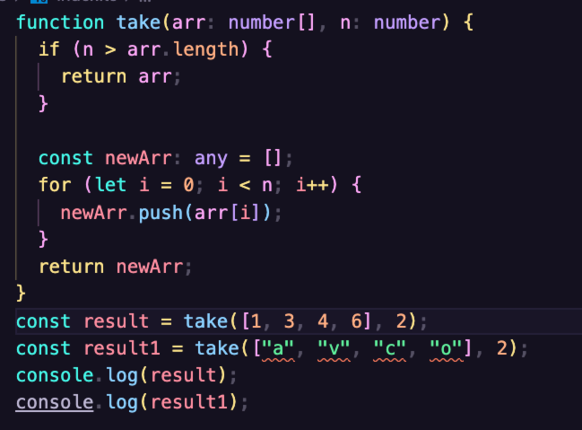
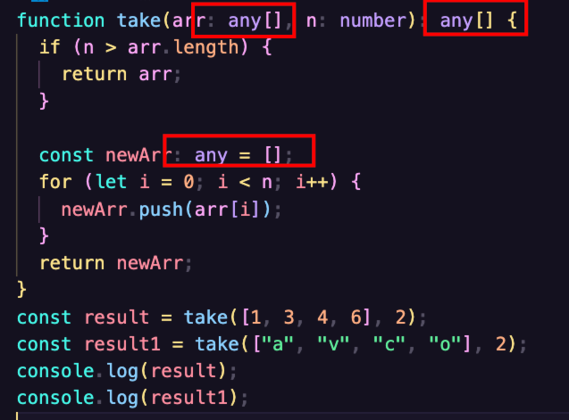
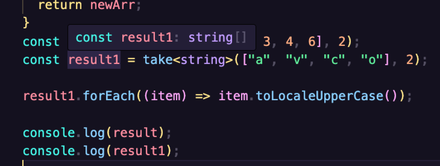
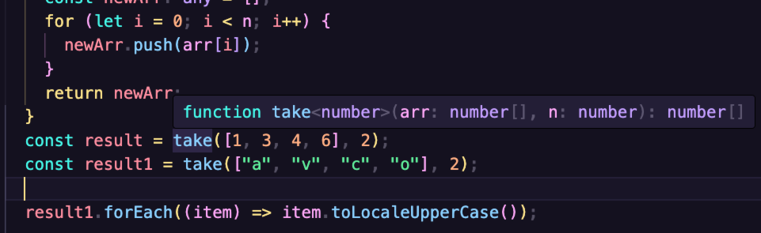

# 8 泛型

目前没有添加任何的类型约束，TS 的优势没发挥多少的作用。

```ts
function take(arr, n) {
  if (n > arr.length) {
    return arr;
  }

  const newArr: any = [];
  for (let i = 0; i < n; i++) {
    newArr.push(arr[i]);
  }
  return newArr;
}
const result = take([1, 3, 4, 6], 2);
console.log(result);
```

下面对代码进行约束。

无法确定 arr 就是一个 number 类型的数组。



不得不写成 any 类型 `function take(arr: any[], n: number): any[]`，好像就没问题了。

仔细观察发现丢失一个信息，三个 any 必须一致。



如果接收到的数组是 string[] 那么所有的地方也都应该是 string[]。

这样我们就得不大类型检查了，我们循环时候需要调用对应的方法。

```ts
const result = take([1, 3, 4, 6], 2);
const result1 = take(["a", "v", "c", "o"], 2);

result1.forEach((item) => item.toUpperCase());

console.log(result);
console.log(result1);
```

有时，书写某个函数的时候，会丢失一些类型的信息（多个位置的类型应该保持一致或有关联的信息）。

这个时候就需要使用泛型来解决.

泛型：是指附属于函数、类、接口、类型别名之上的类型。

泛型就相当于一个类型变量，在定义的时候无法预先知道具体的类型，可以用该变量来代替，只有调用时才能确定它的类型。

可以获取更加一致的类型检查。

## 在函数中使用泛型

在函数名之后写上`<泛型名称>`。

通常为 T，T 表示为一个类型，调用函数的时候传递一个类型.

`take<string>` 表示告诉这个函数操作的数组是一个字符串类型的数组，相当于是把 string 传递给了 T。



TS 还可以进行类型的推断：



很多，TS 会智能的根据传递的参数推断出泛型的具体类型。

如果没有完成推断，并且又没有传递具体的类型，默认为空对象类型（也就是鸭子分辨法）。

给泛型写一个默认值：

`function take<T = number>(arr: T[], n: number): T[] `

比较少见。

## 在类、接口、类型别名中使用泛型

直接在名称后写上`<泛型名称>`。

类型别名：

```ts
type callback<T> = (n: T, i: number) => boolean;

function filter<T>(arr: T[], callback: callback<T>): T[] {
  const newArr: T[] = [];

  arr.forEach((item, index) => {
    if (callback(item, index)) {
      newArr.push(item);
    }
  });
  return newArr;
}
console.log(filter(["a", "s", "r", "t"], (item) => item.length >= 1));
console.log(filter([1, 2, 3, 4, 5, 6, 7], (item) => item % 2 === 1));
```

接口的方式：

```ts
interface callback<T> {
  (n: T, i: number): boolean;
}
```

类的方式：

```ts
export class ArrayHelper<T> {
  arr: T[];

  constructor(arr: T[]) {
    this.arr = arr;
  }

  take(n: number): T[] {
    if (n >= this.arr.length) {
      return this.arr;
    }

    const newArr: T[] = [];
    for (let i = 0; i < this.arr.length; i++) {
      newArr.push(this.arr[i]);
    }
    return newArr;
  }

  shuffle(): T[] {
    return this.arr.sort(() => Math.random() - 0.5);
  }
}

const helper = new ArrayHelper<number>([1, 2, 3, 4, 5, 6, 7]).take(3);
console.log(helper);
```

## 泛型约束

某些情况下，需要对泛型的类型进行约束。

```ts
// 将某个对象的 name 属性的每个单词的首字母进行大写，然后将该对象返回
function nameToUpperCase<T>(obj: T): T {
  obj.name // ❌类型“T”上不存在属性“name”
}

const o = {
  name: "kevin yuan",
  age: 22,
  gender: "男"
};
console.log(nameToUpperCase(o)); // Kevin Yuan
```

这里的 T 就不能是任意的数据类型，至少是一个对象。

```ts
interface hasNameProperty {
  name: string;
}

// 继承接口，表示 T 至少拥有接口内的 name 属性
function nameToUpperCase<T extends hasNameProperty>(obj: T): T {
  obj.name = obj.name
    .split(" ")
    .map((item) => item[0].toUpperCase() + item.slice(1))
    .join(" ");
  return obj;
}

const o = {
  name: "kevin yuan",
  age: 22,
  gender: "男"
};
console.log(nameToUpperCase(o)); // Kevin Yuan
```

表示传递的泛型继承了接口，必须有一个 name 属性。

泛型约束：用于约束泛型的取值。

## 多泛型

```ts
// 将两个数组进行混合 [1, 3, 4] + ["a", "b", "c"] = [1, "a", 3, "b", 4, "c"]
function mixinArray<T, K>(arr1: T[], arr2: K[]): (T | K)[] {
  if (arr1.length != arr2.length) {
    throw new Error("arr1 and arr2 must have the same length!");
  }

  const newArr: (T | K)[] = [];
  for (let i = 0; i < arr1.length; i++) {
    newArr.push(arr1[i]);
    newArr.push(arr2[i]);
  }

  return newArr;
}

// 推导结果：function mixinArray<number, string>(arr1: number[], arr2: string[]): (string | number)[]
let result = mixinArray([1, 2, 3], ["a", "b", "c"]);
console.log(result);
```